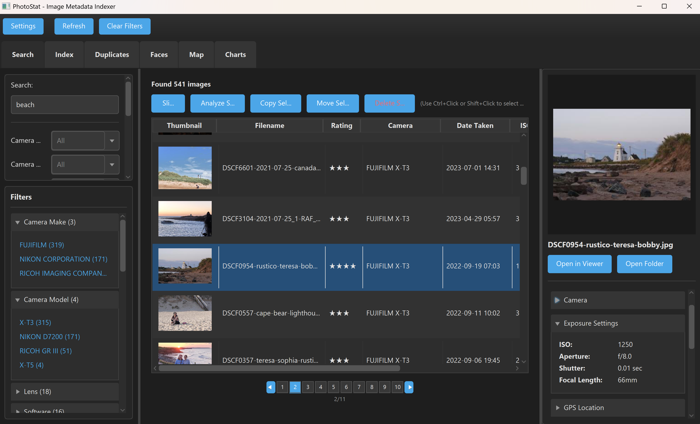

# PhotoStat

A powerful cross-platform desktop application for indexing, searching, and analyzing your photo collection using EXIF metadata. Built with JavaFX and powered by OpenSearch for fast, full-text search capabilities.



---

## Why PhotoStat?

After years of photography and using various software like Lightroom, Capture One, Photoshop, and others to process images, many photographers find themselves with thousands of photos scattered across different applications, catalogs, and drives. Each tool has its own proprietary database, making it difficult to get a unified view of your entire collection.

**PhotoStat was built to solve this problem:**

- **Unified Search Across All Your Photos** - Index images from multiple directories and drives into a single searchable database
- **Find Duplicates** - Find and manage duplicate images
- **No Vendor Lock-In** - Your metadata stays with your photos via portable JSON sidecar files
- **Face Recognition** - Automatic face detection and clustering via InsightFace, with person naming and search integration
- **Cloud Upload** - Upload photos to Google Photos, S3, or 70+ cloud providers via rclone
- **Cross-Platform** - Native installers for Windows (.msi) and macOS (.dmg), plus a cross-platform JAR for Linux and other systems
- **AI-Powered Organization** - Leverage Claude or Gemini AI to automatically tag and categorize your photos

---

## Features

### Core Capabilities
- **Fast Full-Text Search** - Search across all EXIF metadata fields instantly
- **Faceted Navigation** - Filter by camera, lens, file type, ISO, date, and more
- **Thumbnail Preview** - Quick visual preview of search results
- **Multi-Directory Indexing** - Index photos from multiple locations with selective directory choice
- **Background Indexing** - Continue working while photos are being indexed
- **Interactive GPS Map** - Browse geotagged photos on an interactive OpenStreetMap with clustering

### Metadata & Organization
- **Complete EXIF Support** - Camera, lens, exposure, GPS, and more
- **Custom Metadata** - Add persons, places, tags, and ratings
- **Keyboard Rating** - Press 1-5 to rate, 0 to clear — instant save for fast culling
- **Slideshow Mode** - Full-screen browsing with keyboard navigation, quick rating, and image deletion
- **Dark Theme** - Switch between light and dark themes in Settings for comfortable low-light use
- **Sidecar Files** - Metadata persists with your images
- **Copy & Paste Metadata** - Quickly apply tags across multiple images

### AI Analysis
- **Multiple Providers** - Claude (Anthropic) or Gemini (Google)
- **Smart Tagging** - Automatic subject, style, and mood detection
- **Quality Rating** - AI-generated ratings based on composition
- **Batch Processing** - Analyze via GUI or command-line
- **Cost Tracking** - Monitor token usage and estimated costs

> See [docs/AI_ANALYSIS.md](docs/AI_ANALYSIS.md) for API key setup, CLI usage, cost tracking, and provider configuration.

### Face Recognition
- **Automatic Detection** - Detect faces in your photo collection using InsightFace (Python)
- **Face Clustering** - Automatically group similar faces using DBSCAN or centroid-based clustering
- **Person Naming** - Assign names to face clusters; names are saved to OpenSearch and sidecar files
- **Cluster Merging** - Merge clusters that belong to the same person
- **Incremental Scanning** - Only new images are processed on re-runs; safe to interrupt and resume
- **GPU Acceleration** - Automatically uses CUDA GPU when available for faster detection
- **CLI Support** - Batch face detection with parallel workers via `--detect-faces`

> See [docs/FACE_RECOGNITION.md](docs/FACE_RECOGNITION.md) for full setup instructions, Windows GPU configuration, and workflow details.

### Duplicate Detection
- **Exact Duplicates** - SHA-256 content hashing finds byte-for-byte copies
- **Visual Duplicates** - Perceptual hashing (dHash) finds resized, recompressed, or re-exported copies
- **Reclaimable Space** - See how much disk space you can recover
- **Bulk Delete** - Select and remove duplicates with confirmation

### Cloud Upload
- **rclone Integration** - Upload photos to 70+ cloud providers (Google Photos, S3, Dropbox, etc.)
- **Upload Selected Images** - Select images from search results and upload to any remote with a progress dialog
- **Duplicate Upload Prevention** - Tracks which remotes each file has been uploaded to; skips already-uploaded files automatically
- **Separate Upload Directories** - Upload directories are independent from indexing directories
- **GUI & CLI** - Upload via the toolbar button with progress dialog, or schedule via `--rclone-upload`
- **Incremental Uploads** - rclone only uploads new/changed files
- **Sidecar Exclusion** - `.photostat.json` sidecar files are automatically excluded

### Visualizations
- **Camera Usage Charts** - See which cameras and lenses you use most
- **Timeline View** - Visualize your collection over time
- **Exposure Analysis** - ISO, aperture, and focal length distributions
- **Processing Software**
- **GPS Map** - Interactive map view of geotagged photos with cluster and marker modes

---

## Quick Start

### 1. Prerequisites

| Requirement | Version | Notes |
|-------------|---------|-------|
| OpenSearch | 2.x | Required for all installation methods |
| Java | 21 or later | Only needed for the cross-platform JAR — installers bundle their own runtime |

### 2. Install Docker

If you don't already have Docker installed:

| Platform | Installation |
|----------|-------------|
| **Windows** | Download [Docker Desktop for Windows](https://www.docker.com/products/docker-desktop/) — requires WSL 2 (the installer will guide you) |
| **macOS** | Download [Docker Desktop for Mac](https://www.docker.com/products/docker-desktop/) — choose Apple Silicon or Intel chip |
| **Linux** | Install via your package manager (see below) |

**Linux (Ubuntu/Debian):**
```bash
sudo apt update
sudo apt install docker.io
sudo systemctl enable --now docker
sudo usermod -aG docker $USER   # Log out and back in after this
```

**Linux (Fedora/RHEL):**
```bash
sudo dnf install docker
sudo systemctl enable --now docker
sudo usermod -aG docker $USER
```

Verify Docker is working:
```bash
docker --version
docker run hello-world
```

### 3. Install OpenSearch

**Docker (Recommended):**

Pull the OpenSearch image:
```bash
docker pull opensearchproject/opensearch:2.11.0
```

Create a volume for persistent storage and run the container:
```bash
docker volume create opensearch-data

docker run -d --name opensearch \
  -p 9200:9200 \
  -v opensearch-data:/usr/share/opensearch/data \
  -e "discovery.type=single-node" \
  -e "DISABLE_SECURITY_PLUGIN=true" \
  opensearchproject/opensearch:2.11.0
```

This ensures your indexed data survives container restarts and removals. To manage the container:
```bash
docker stop opensearch     # Stop the container
docker start opensearch    # Start it again (data is preserved)
docker rm opensearch       # Remove the container (volume keeps data)
```

Or download from [opensearch.org](https://opensearch.org/downloads.html).

### 4. Download & Install PhotoStat

Download the latest release from **[GitHub Releases](https://github.com/ppound/photostat/releases)**. Choose the option that fits your platform:

#### Option A: Windows Installer (.msi)

Download `PhotoStat-1.9.12.msi`, double-click to install, and launch from the Start Menu. No Java installation required.

#### Option B: macOS Installer (.dmg) — Apple Silicon only

Download `PhotoStat-1.9.12-apple-silicon.dmg`, open it, and drag PhotoStat to your Applications folder. No Java installation required.

> **Note:** The macOS installer is unsigned. On first launch, **right-click** the app in Finder and select **Open**, then click **Open** in the dialog. If that doesn't work, go to **System Settings → Privacy & Security** and click **Open Anyway** next to the blocked app message. See [Troubleshooting](docs/TROUBLESHOOTING.md#macos-photostat-is-damaged-or-cannot-be-opened) for details.
>
> **Intel Mac users:** A DMG installer is not available for Intel Macs. Use the cross-platform JAR below (`photostat-java-1.9.12-executable-mac-intel.jar`).

#### Option C: Cross-platform JAR

Download `photostat-java-1.9.12-executable.jar`. Requires Java 21+. This JAR includes native libraries for **Windows**, **Linux**, and **macOS Apple Silicon** (M1/M2/M3/M4).

```bash
java -jar photostat-java-1.9.12-executable.jar
```

**Intel Mac users:** Download the separate `photostat-java-1.9.12-executable-mac-intel.jar` which includes Intel (x86_64) macOS natives instead of Apple Silicon. See [Troubleshooting](docs/TROUBLESHOOTING.md#error-on-intel-mac-no-suitable-pipeline-found-or-graphics-errors).

### 5. Get Started

1. Configure OpenSearch connection via **File > Settings**
2. Add photo directories in the **Index** tab
3. Click **Start Indexing**
4. Search your photos in the **Search** tab

---

## Documentation

| Document | Description |
|----------|-------------|
| [User Guide](docs/USER_GUIDE.md) | Detailed usage instructions for all features |
| [AI Analysis](docs/AI_ANALYSIS.md) | AI setup, CLI mode, and cost tracking |
| [Face Recognition](docs/FACE_RECOGNITION.md) | Python setup, GPU acceleration, and face detection workflow |
| [Configuration](docs/CONFIGURATION.md) | All settings and options explained |
| [Troubleshooting](docs/TROUBLESHOOTING.md) | Common issues and solutions |
| [Development](docs/DEVELOPMENT.md) | Building from source and project structure |

---

## Command-Line Interface

PhotoStat includes a CLI for batch image analysis. The CLI requires the cross-platform JAR and Java 21+ — the native installers (MSI/DMG) are for the GUI only.

```bash
# Analyze all configured directories
java -jar photostat-java-1.9.12-executable.jar --analyze

# Preview what would be analyzed
java -jar photostat-java-1.9.12-executable.jar --analyze --dry-run

# Run with 4 parallel threads
java -jar photostat-java-1.9.12-executable.jar --analyze --parallel 4

# Use Gemini instead of Claude
java -jar photostat-java-1.9.12-executable.jar --analyze --provider gemini

# Find duplicate images
java -jar photostat-java-1.9.12-executable.jar --find-duplicates

# Find visually similar images
java -jar photostat-java-1.9.12-executable.jar --find-duplicates --mode visual

# Detect and cluster faces
java -jar photostat-java-1.9.12-executable.jar --detect-faces

# Face detection with 4 parallel workers
java -jar photostat-java-1.9.12-executable.jar --detect-faces --parallel 4

# Face detection on a specific directory
java -jar photostat-java-1.9.12-executable.jar --detect-faces --dir /path/to/photos

# Upload to cloud via rclone
java -jar photostat-java-1.9.12-executable.jar --rclone-upload

# Preview what would be uploaded
java -jar photostat-java-1.9.12-executable.jar --rclone-upload --dry-run
```

See [AI Analysis - CLI](docs/AI_ANALYSIS.md#command-line-interface-cli) for full documentation.

---

## Supported Formats

### Native Support
JPEG, PNG, TIFF, GIF, BMP, WebP

### RAW Support (requires ExifTool)
Canon (CR2, CR3), Nikon (NEF), Sony (ARW), Fujifilm (RAF), and more.

Install ExifTool:
- **Windows:** Download from [exiftool.org](https://exiftool.org/)
- **macOS:** `brew install exiftool`
- **Linux:** `sudo apt install libimage-exiftool-perl`

---

## Technology Stack

| Component | Technology |
|-----------|------------|
| GUI | JavaFX 21 |
| Search | OpenSearch 2.x |
| AI | Claude API, Gemini API |
| Face Recognition | InsightFace (Python sidecar) |
| EXIF | metadata-extractor, ExifTool |
| Build | Maven |

---

## License

MIT License - See [LICENSE](LICENSE) for details.

---

## Links

- [GitHub Repository](https://github.com/ppound/photostat)
- [Report Issues](https://github.com/ppound/photostat/issues)
- [Releases](https://github.com/ppound/photostat/releases)
