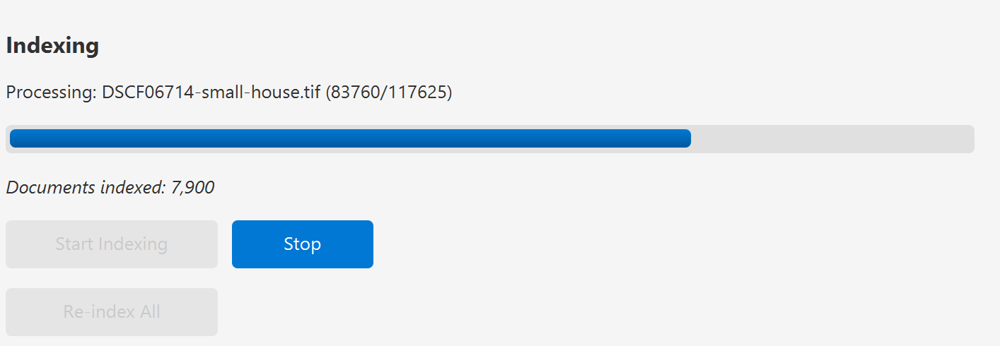

# PhotoStat Java

A powerful cross-platform desktop application for indexing, searching, and analyzing your photo collection using EXIF metadata. Built with JavaFX and powered by OpenSearch for fast, full-text search capabilities.


---

## Why PhotoStat?

After years of photography and using various software like Lightroom, Capture One, Photoshop, and others to process images, many photographers find themselves with thousands of photos scattered across different applications, catalogs, and drives. Each tool has its own proprietary database, making it difficult to get a unified view of your entire collection.

**PhotoStat was built to solve this problem:**

- **Unified Search Across All Your Photos** - Index images from multiple directories and drives into a single searchable database, regardless of which software was used to edit them
- **No Vendor Lock-In** - Your metadata stays with your photos via portable JSON sidecar files, not trapped in proprietary catalogs
- **Cross-Platform** - Runs on Windows, macOS, and Linux with a single executable JAR
- **Backup-Friendly** - Sidecar files travel with your images, so custom metadata survives backups, moves, and drive migrations
- **Open Standards** - Built on OpenSearch for powerful, fast searching with a query syntax you may already know
- **AI-Powered Organization** - Leverage Claude AI to automatically tag and categorize your photos, making it easier to find images even if you never manually tagged them

Whether you're consolidating years of photos from different tools, migrating to a new system, or just want a fast way to search and organize your collection, PhotoStat gives you control over your photo library.

---

## Table of Contents

- [Why PhotoStat?](#why-photostat)
- [Features](#features)
- [System Requirements](#system-requirements)
- [Installation](#installation)
  - [Download](#download)
  - [Install Java 21](#install-java-21)
  - [Install OpenSearch](#install-opensearch)
  - [Install ExifTool (Optional)](#install-exiftool-optional)
- [Quick Start](#quick-start)
- [User Guide](#user-guide)
  - [First Launch](#first-launch)
  - [Configuring OpenSearch](#configuring-opensearch)
  - [Adding Directories](#adding-directories)
  - [Indexing Images](#indexing-images)
  - [Searching Your Photos](#searching-your-photos)
  - [Using Faceted Navigation](#using-faceted-navigation)
  - [Viewing Image Details](#viewing-image-details)
  - [Adding Custom Metadata](#adding-custom-metadata)
  - [AI Image Analysis](#ai-image-analysis)
  - [Configuring Claude AI](#configuring-claude-ai)
  - [Managing Files](#managing-files)
  - [Exploring Charts](#exploring-charts)
  - [Thumbnail Cache](#thumbnail-cache)
  - [Sidecar Files](#sidecar-files)
  - [Enabling Logging](#enabling-logging)
- [Supported Image Formats](#supported-image-formats)
- [Configuration](#configuration)
- [Troubleshooting](#troubleshooting)
- [Building from Source](#building-from-source)
- [Project Structure](#project-structure)
- [License](#license)

---

## Features

### Core Features

- **Fast Full-Text Search** - Search across all EXIF metadata fields instantly
- **Faceted Navigation** - Filter by camera make, model, lens, file type, ISO range, and date
- **Autocomplete Filters** - Type-ahead filtering for camera, lens, and custom metadata fields
- **Multi-Select Filters** - Select multiple persons, places, or tags with chip-style UI
- **Thumbnail Preview** - Quick visual preview of search results
- **Multi-Directory Indexing** - Index photos from multiple locations on your computer
- **Background Indexing** - Continue working while photos are being indexed
- **File Operations** - Copy, move, or delete images directly from search results

### Metadata Support

- **Camera Information** - Make, model, lens, software
- **Exposure Settings** - ISO, aperture, shutter speed, focal length
- **Date/Time** - When the photo was taken
- **GPS Location** - Latitude and longitude with Google Maps integration
- **Image Dimensions** - Width, height, orientation
- **Custom Metadata** - Add your own persons, places, and tags to organize photos

### Visualizations

- **Camera Usage Charts** - See which cameras and lenses you use most
- **Timeline View** - Visualize your photo collection over time
- **Exposure Analysis** - ISO distribution, aperture histogram, focal length usage
- **File Type Breakdown** - Pie chart of image formats in your collection

### Custom Metadata

- **Persons** - Tag people in your photos
- **Places** - Add location names to photos
- **Tags** - Create custom tags for organization
- **Rating** - Rate image quality from * to ***** (1-5 stars)
- **Multi-Select Chips** - Person, Place, and Tag filters use chip-style UI for selecting multiple values
- **Autocomplete** - Type-ahead suggestions when adding metadata
- **Copy & Paste** - Copy metadata from one image and paste to others
- **Searchable** - All custom metadata is fully searchable
- **Faceted** - Filter by person, place, or tag using facets (clicks add to selection)

### AI Image Analysis

- **Claude Vision API** - Analyze images using Claude AI to auto-populate metadata
- **Batch Processing** - Analyze multiple selected images at once
- **Smart Tagging** - Automatically detect subjects, styles, and moods
- **Quality Rating** - AI-generated rating based on composition, sharpness, and artistic value
- **Person Detection** - Describe people visible in images
- **Location Recognition** - Identify places and settings
- **Analysis Caching** - Skips API calls for unchanged images to reduce costs
- **Customizable Prompt** - Modify the analysis prompt in config.json

### Thumbnail Caching

- **Disk Cache** - Thumbnails cached to disk for faster loading
- **Configurable Size** - Set maximum cache size (default 500 MB)
- **LRU Eviction** - Old thumbnails automatically removed when limit reached
- **Auto-Invalidation** - Cache updates when source images are modified

### Sidecar Files (Persistent Custom Metadata)

- **JSON Sidecar Files** - Custom metadata saved as `.photostat.json` files
- **Survives Reindexing** - Metadata preserved when rebuilding the index
- **Optional** - Can be disabled if you don't want extra files
- **Portable** - Sidecar files travel with your images

### File Operations

- **Copy Images** - Copy selected images to a new directory
- **Move Images** - Move images and automatically update the search index
- **Delete Images** - Remove images from disk and the search index
- **Multi-Select** - Select multiple images for bulk operations
- **Sidecar Support** - Sidecar files are copied/moved/deleted alongside images
- **Optional Re-indexing** - Choose whether to index copied files at the new location

### Logging & Debugging

- **Configurable Logging** - Enable/disable file logging
- **Log Levels** - DEBUG, INFO, WARN, ERROR
- **Log File** - Logs saved to `~/.photostat/photostat.log`

### Cross-Platform

- **Windows, macOS, and Linux** - Single executable JAR runs on all platforms
- **No Installation Required** - Just download and run

---

## System Requirements

| Requirement | Minimum | Recommended |
|-------------|---------|-------------|
| **Java** | Java 21 | Java 21 or later |
| **RAM** | 2 GB | 4 GB or more |
| **Disk Space** | 100 MB (application) | 500 MB+ for thumbnail cache |
| **OpenSearch** | 2.x | 2.10 or later |

---

## Installation

### Download

Download the latest release from the **[GitHub Releases Page](https://github.com/ppound/photostat/releases)**:

```
photostat-java-1.5.0-executable.jar
```

This is a self-contained JAR file that includes all dependencies. No installation is required.

### Install Java 21

PhotoStat requires Java 21 or later.

#### Windows

1. Download Java 21 from [Adoptium](https://adoptium.net/) or [Oracle](https://www.oracle.com/java/technologies/downloads/)
2. Run the installer
3. Verify installation by opening Command Prompt and typing:
   ```cmd
   java -version
   ```

#### macOS

Using Homebrew:
```bash
brew install openjdk@21
```

Or download from [Adoptium](https://adoptium.net/).

#### Linux

Ubuntu/Debian:
```bash
sudo apt update
sudo apt install openjdk-21-jdk
```

Fedora:
```bash
sudo dnf install java-21-openjdk
```

Verify installation:
```bash
java -version
```

### Install OpenSearch

PhotoStat uses OpenSearch as its search backend. You need a running OpenSearch instance.

#### Option 1: Docker (Recommended)

```bash
docker run -d --name opensearch \
  -p 9200:9200 \
  -e "discovery.type=single-node" \
  -e "DISABLE_SECURITY_PLUGIN=true" \
  opensearchproject/opensearch:2.11.0
```

#### Option 2: Download and Install

1. Download from [opensearch.org](https://opensearch.org/downloads.html)
2. Extract and run:
   ```bash
   # Linux/macOS
   ./opensearch-2.11.0/bin/opensearch

   # Windows
   opensearch-2.11.0\bin\opensearch.bat
   ```

#### Verify OpenSearch is Running

Open a browser and navigate to:
```
http://localhost:9200
```

You should see a JSON response with cluster information.

### Install ExifTool (Optional)

ExifTool is required for RAW file support (CR2, CR3, NEF, ARW, etc.).

#### Windows

1. Download from [exiftool.org](https://exiftool.org/)
2. Extract `exiftool(-k).exe` to a folder
3. Rename to `exiftool.exe`
4. Add the folder to your system PATH

#### macOS

```bash
brew install exiftool
```

#### Linux

Ubuntu/Debian:
```bash
sudo apt install libimage-exiftool-perl
```

Fedora:
```bash
sudo dnf install perl-Image-ExifTool
```

---

## Quick Start

1. **Ensure OpenSearch is running** (see installation above)

2. **Launch PhotoStat**:

   **Windows / Linux / Intel Mac:**
   ```bash
   java -jar photostat-java-1.5.0-executable.jar
   ```

   **Apple Silicon Mac (M1/M2/M3):**

   The executable JAR requires the JavaFX SDK for Apple Silicon. Download and run:
   ```bash
   # Download JavaFX SDK for Mac ARM64 from https://gluonhq.com/products/javafx/
   # Extract to a folder, then run:
   java --module-path /path/to/javafx-sdk-21/lib \
        --add-modules javafx.controls,javafx.fxml,javafx.swing \
        -jar photostat-java-1.5.0-executable.jar
   ```

3. **Configure connection** (if needed) via File > Settings

4. **Add a photo directory** in the Index tab

5. **Click "Start Indexing"** and wait for completion

6. **Search your photos** in the Search tab

---

## User Guide

### First Launch

When you first launch PhotoStat, you'll see the main window with three tabs:

- **Search** - Find and browse your indexed photos
- **Index** - Manage directories and run indexing
- **Charts** - View visualizations of your collection


### Configuring OpenSearch

1. Click **File > Settings** or the **Settings** button

   

2. In the Settings dialog, configure your OpenSearch connection:

   | Setting | Default | Description |
   |---------|---------|-------------|
   | Host | localhost | OpenSearch server hostname |
   | Port | 9200 | OpenSearch HTTP port |
   | Use SSL | No | Enable for HTTPS connections |
   | Index Name | photostat | Name of the search index |

   

3. Click **Test Connection** to verify connectivity

4. Click **Save** to apply changes

### Adding Directories

1. Navigate to the **Index** tab

   

2. Click **Add Directory** button

3. In the directory browser:
   - Navigate to your photo folder
   - Or use the drive buttons for quick access
   - Click **Select** when you've chosen your folder

   

4. The directory will appear in the list with its path

5. Repeat to add more directories as needed

**Tips:**
- Add your main photo library folder (e.g., `Pictures`, `Photos`)
- You can add network drives if they're mounted
- Subdirectories are automatically included

### Indexing Images

1. In the **Index** tab, verify your directories are listed

2. Click **Start Indexing**

   

3. Watch the progress bar and status messages:
   - "Scanning directories..." - Finding image files
   - "Indexing: filename.jpg" - Processing individual files
   - "Indexed X of Y files" - Progress update

   

4. Wait for "Indexing complete" message

**Notes:**
- Indexing runs in the background - you can switch tabs
- Large collections may take several minutes
- Only new/modified files are re-indexed on subsequent runs
- Click **Stop Indexing** to cancel if needed

### Searching Your Photos

1. Navigate to the **Search** tab

   

2. **Text Search**: Type keywords in the search box
   - Camera names: "Canon", "Nikon D850"
   - Lens info: "50mm", "70-200"
   - File names: "vacation", "2023"
   - Any EXIF field value

3. **Filter Options**:

   | Filter | Description |
   |--------|-------------|
   | Camera Make | Filter by manufacturer with autocomplete (Canon, Nikon, Sony...) |
   | Camera Model | Filter by specific camera model with autocomplete |
   | Lens | Filter by lens used with autocomplete |
   | File Type | JPEG, PNG, RAW formats |
   | Date Range | Photos taken between dates |
   | ISO Range | Filter by ISO sensitivity |
   | Aperture | Filter by f-stop value |
   | Person | Multi-select with chips - filter by tagged people |
   | Place | Multi-select with chips - filter by location |
   | Tags | Multi-select with chips - filter by custom tags |
   | Rating | Filter by quality rating with autocomplete |

   **Autocomplete**: Camera, lens, and rating fields support type-ahead filtering - start typing to narrow down options.

   **Multi-Select Chips**: Person, Place, and Tag filters display selected values as removable chips, allowing you to filter by multiple values simultaneously (AND logic - all selected values must match).

   

4. Click **Search** or press Enter

5. Results appear in the table below with:
   - Thumbnail preview
   - Filename
   - Camera info
   - Date taken
   - Exposure settings

   

### Using Faceted Navigation

The **Facets Panel** on the left shows aggregated counts for quick filtering:


**Available Facets:**
- **Camera Make** - Click to filter by manufacturer
- **Camera Model** - Click to filter by specific model
- **Lens Model** - Click to filter by lens
- **File Type** - Click to filter by format
- **ISO Range** - Click to filter by ISO bracket
- **Year/Month** - Click to filter by time period
- **Persons** - Click to filter by tagged people
- **Places** - Click to filter by location name
- **Tags** - Click to filter by custom tags

**How to Use:**
1. Click any facet value to apply that filter
2. The search results update immediately
3. Other facets update to show remaining options
4. For Person, Place, and Tag facets: clicking adds to existing selections (displayed as chips)
5. Remove individual filters by clicking the X on chips, or use Clear Filters to reset all

### Viewing Image Details

1. Click on any row in the search results

2. The **Detail Panel** on the right shows:

   

   **Preview Image** - Larger thumbnail of the selected photo

   **File Information:**
   - Full file path
   - File size
   - Image dimensions
   - Date taken

   **Camera Information:**
   - Make and model
   - Lens used
   - Software/editor

   **Exposure Settings:**
   - ISO
   - Aperture (f-stop)
   - Shutter speed
   - Focal length

   **GPS Location** (if available):
   - Latitude/Longitude
   - "Open in Google Maps" link

3. **Action Buttons:**
   - **Open in Viewer** - Opens the image in your default photo viewer
   - **Open Folder** - Opens the containing folder in file explorer

### Adding Custom Metadata

You can add your own metadata to photos for better organization:

1. **Select an image** in the search results

2. In the **Detail Panel**, find the **Custom Metadata** section:

   

3. **Add metadata:**

   | Field | Description | Example |
   |-------|-------------|---------|
   | **Persons** | Names of people in the photo (comma-separated) | "John, Jane, Bob" |
   | **Place** | Location name | "Central Park, NYC" |
   | **Tags** | Custom tags (comma-separated) | "vacation, family, summer" |
   | **Rating** | Quality rating using asterisks | "***" (3 stars) |

4. Click **Save Metadata** to save changes

5. The search will automatically refresh

**Using Custom Metadata:**
- Search for names, places, or tags in the search box
- Use the **Persons**, **Places**, and **Tags** facets to filter
- Use the filter dropdowns in the **Custom Metadata** section of the search panel

**Copy & Paste Metadata:**

You can copy custom metadata from one image and paste it to others:

1. Select an image with the metadata you want to copy
2. Click **Copy** in the Custom Metadata section
3. Select another image
4. Click **Paste** to fill in the fields
5. Click **Save** to apply the changes

This is useful when multiple photos share the same people, location, or tags.

### AI Image Analysis

PhotoStat can automatically analyze your images using Claude AI's vision capabilities to populate metadata fields.

**What the AI Analyzes:**

| Field | Description | Examples |
|-------|-------------|----------|
| **Tags** | Photography style, subjects, mood, technical aspects | "Portrait", "Landscape", "Black and White", "Bokeh" |
| **Persons** | Descriptions of people in the image | "woman in red dress", "elderly man", "child" |
| **Place** | Location if identifiable | "Beach", "Restaurant", "Central Park" |
| **Rating** | Quality rating from * to ***** | Based on composition, sharpness, artistic value |

**Using AI Analysis:**

1. **Select images** in the search results (use Ctrl+Click or Shift+Click for multiple)

2. Click **Analyze Selected** in the toolbar above the results

   

3. **Confirm** the analysis - you'll see how many images will be processed

4. **Monitor progress** - a progress dialog shows:
   - Progress bar with completion percentage
   - Current image count (X of Y)
   - Current file being analyzed
   - Error count during processing
   - **Cancel** button to stop after the current image

5. When complete, a summary shows successes, failures, and any errors

6. Results are **automatically saved** to OpenSearch and sidecar files

**Notes:**
- Only JPG, PNG, GIF, and WebP images are supported for analysis
- RAW files cannot be analyzed directly
- API usage incurs costs - each image uses API credits
- Large batches may take several minutes to process

**Analysis Caching:**

PhotoStat caches analysis results to avoid redundant API calls and reduce costs:

- An `analysisHash` is stored in the sidecar file after each analysis
- The hash combines: model + prompt + image (file size + modification time)
- When re-analyzing, images with matching hashes are skipped
- The progress dialog shows "Cached (skipped)" count for unchanged images
- Cache is invalidated when you:
  - Change the Claude model in settings
  - Modify the analysis prompt in config.json
  - Edit or replace the image file

**Customizing the Analysis Prompt:**

You can customize how Claude analyzes your images by editing the prompt in `~/.photostat/config.json`:

```json
{
  "claude": {
    "api_key": "sk-ant-...",
    "model": "claude-sonnet-4-20250514",
    "analysis_prompt": "Your custom prompt here..."
  }
}
```

Changing the prompt will invalidate the cache, causing all images to be re-analyzed on next run.

**Rating Scale:**

| Rating | Meaning |
|--------|---------|
| * | Poor - significant technical issues, bad composition |
| ** | Below average - noticeable issues, weak composition |
| *** | Average - decent execution, standard composition |
| **** | Good - strong composition, good technique, visually appealing |
| ***** | Excellent - exceptional composition, masterful technique |

### Configuring Claude AI

To use the AI analysis feature, you need to configure your Claude API key.

**Getting an API Key:**

1. Visit [Anthropic Console](https://console.anthropic.com/)
2. Create an account or sign in
3. Navigate to **API Keys**
4. Click **Create Key** and copy the key

**Configuring in PhotoStat:**

1. Open **File > Settings**

2. Navigate to the **Claude AI** tab

   

3. Enter your **API Key** (starts with `sk-ant-...`)

4. Select a **Model**:

   | Model | Description |
   |-------|-------------|
   | claude-sonnet-4-20250514 | Fast, cost-effective (recommended) |
   | claude-opus-4-20250514 | Most capable, higher cost |
   | claude-3-5-sonnet-20241022 | Previous generation Sonnet |
   | claude-3-5-haiku-20241022 | Fastest, lowest cost |

5. Click **Test API Key** to verify your key works

6. Click **OK** to save

**API Costs:**

- Each image analyzed uses API credits
- Costs depend on image size and selected model
- Sonnet models offer the best balance of quality and cost
- Monitor usage at [console.anthropic.com](https://console.anthropic.com/)

**Troubleshooting:**

| Error | Solution |
|-------|----------|
| "API Key Required" | Configure your API key in Settings > Claude AI |
| "Invalid API key" | Check that the key is correct and active |
| "API error: 429" | Rate limited - wait and try again with fewer images |
| "Analysis failed" | Check internet connection; verify image format is supported |

### Managing Files

You can copy, move, or delete images directly from search results:


**Selecting Images:**
1. **Single selection** - Click on a row to select one image
2. **Multi-select** - Use Ctrl+Click to add individual images to selection
3. **Range select** - Use Shift+Click to select a range of images

**Available Operations:**

| Operation | Button | Description |
|-----------|--------|-------------|
| **Copy** | Copy Selected... | Copy images to a new directory |
| **Move** | Move Selected... | Move images to a new directory |
| **Delete** | Delete Selected | Permanently delete images |

**Copy Images:**
1. Select one or more images
2. Click **Copy Selected...**
3. Choose a destination directory
4. After copying, you'll be asked if you want to index the copied files
   - Click **OK** to add them to the search index
   - Click **Cancel** to skip indexing
5. A summary shows the result and indexing status

**Move Images:**
1. Select one or more images
2. Click **Move Selected...**
3. Choose a destination directory
4. Files are moved and automatically re-indexed at the new location
5. A summary shows the result and indexing status

**Delete Images:**
1. Select one or more images
2. Click **Delete Selected**
3. Confirm the deletion in the warning dialog
4. Files are permanently deleted from disk and removed from the index

**Notes:**
- Sidecar files (`.photostat.json`) are automatically copied/moved/deleted with their images
- Move and delete operations update the search index automatically
- Deleted files cannot be recovered - use with caution!

### Exploring Charts

Navigate to the **Charts** tab to visualize your collection:


**Available Views:**

1. **Overview**
   - Camera makes bar chart
   - File types pie chart

   

2. **Timeline**
   - Photos by month/year line chart
   - See your photography activity over time

   

3. **Exposure**
   - ISO distribution histogram
   - Aperture usage chart
   - Focal length distribution

   

4. **Locations** (if GPS data available)
   - Map plot of photo locations

### Thumbnail Cache

PhotoStat caches generated thumbnails to disk for faster loading on subsequent views.

**Configure Cache Settings:**

1. Open **File > Settings**
2. Navigate to the **Cache** tab
3. Configure options:

   | Setting | Description |
   |---------|-------------|
   | Enable Disk Cache | Turn disk caching on/off |
   | Max Cache Size | Maximum disk space for cache (100-5000 MB) |

4. View cache statistics (file count and size)
5. Click **Clear Cache** to remove all cached thumbnails

**Cache Location:** `~/.photostat/cache/`

**How It Works:**
- Thumbnails are saved as JPEG files with hashed filenames
- Cache key includes file path, modification time, and thumbnail size
- If source image is modified, a new thumbnail is generated automatically
- When cache exceeds max size, oldest thumbnails are removed (LRU eviction)

### Sidecar Files

Sidecar files allow custom metadata (persons, places, tags) to persist even when rebuilding the search index.

**How It Works:**
- When you save custom metadata, a `.photostat.json` file is created alongside the image
- Example: `IMG_1234.jpg` → `IMG_1234.jpg.photostat.json`
- When re-indexing, PhotoStat reads the sidecar and restores your custom metadata

**Example Sidecar File:**
```json
{
  "persons" : [ "John", "Jane" ],
  "place" : "Central Park",
  "tags" : [ "vacation", "family" ],
  "rating" : "****"
}
```

**Configure Sidecar Settings:**

1. Open **File > Settings**
2. Navigate to the **Indexing** tab
3. Toggle **"Save custom metadata to sidecar files"**

**Benefits:**
- Custom metadata survives index rebuilds
- Metadata travels with images if files are moved/copied
- Can be backed up alongside photos
- Human-readable JSON format

**Note:** If disabled, custom metadata is only stored in OpenSearch and will be lost if the index is deleted.

### Enabling Logging

PhotoStat includes file-based logging for debugging:

1. **Edit the config file** at `~/.photostat/config.json`

2. **Add or modify the logging section:**

   ```json
   {
     "logging": {
       "enabled": true,
       "level": "INFO"
     }
   }
   ```

3. **Available log levels** (from most to least verbose):

   | Level | Description |
   |-------|-------------|
   | `DEBUG` | All messages including detailed debug info |
   | `INFO` | General information, warnings, and errors |
   | `WARN` | Warnings and errors only |
   | `ERROR` | Errors only |

4. **Log file location:** `~/.photostat/photostat.log`

5. **Restart the application** for changes to take effect

**Note:** Logging is disabled by default to avoid unnecessary disk writes.

---

## Supported Image Formats

### Native Support (No ExifTool Required)

| Format | Extensions |
|--------|------------|
| JPEG | .jpg, .jpeg |
| PNG | .png |
| TIFF | .tiff, .tif |
| GIF | .gif |
| BMP | .bmp |
| WebP | .webp |

### RAW Support (Requires ExifTool)

| Camera | Extensions |
|--------|------------|
| Canon | .cr2, .cr3 |
| Nikon | .nef, .nrw |
| Sony | .arw, .srf, .sr2 |
| Fujifilm | .raf |
| Olympus | .orf |
| Panasonic | .rw2 |
| Pentax | .pef |
| Adobe | .dng |
| Leica | .rwl |
| Samsung | .srw |

---

## Configuration

Configuration is stored in `~/.photostat/config.json`:

```json
{
  "opensearch": {
    "host": "localhost",
    "port": 9200,
    "ssl": false,
    "index_name": "photostat",
    "username": "",
    "password": ""
  },
  "indexing": {
    "directories": [
      "/home/user/Pictures",
      "/media/photos"
    ],
    "batch_size": 50,
    "file_extensions": [".jpg", ".jpeg", ".png", ".cr2", ".nef", ".arw", ".dng", ".raf"]
  },
  "ui": {
    "thumbnail_size": 200,
    "results_per_page": 50
  },
  "exiftool": {
    "path": "exiftool",
    "use_for_raw": true
  },
  "logging": {
    "enabled": false,
    "level": "INFO"
  },
  "cache": {
    "enabled": true,
    "max_size_mb": 500
  },
  "sidecar": {
    "enabled": true
  },
  "claude": {
    "api_key": "",
    "model": "claude-sonnet-4-20250514"
  }
}
```

| Setting | Description |
|---------|-------------|
| `opensearch.host` | OpenSearch server hostname |
| `opensearch.port` | OpenSearch HTTP port |
| `opensearch.ssl` | Enable HTTPS connection |
| `opensearch.index_name` | Name of the index to use |
| `opensearch.username` | Username for authentication (optional) |
| `opensearch.password` | Password for authentication (optional) |
| `indexing.directories` | List of directories to index |
| `indexing.batch_size` | Number of files to index per batch |
| `ui.thumbnail_size` | Maximum thumbnail dimension in pixels |
| `ui.results_per_page` | Number of results per page |
| `exiftool.path` | Path to ExifTool executable |
| `exiftool.use_for_raw` | Use ExifTool for RAW files |
| `logging.enabled` | Enable file logging (default: false) |
| `logging.level` | Log level: DEBUG, INFO, WARN, ERROR |
| `cache.enabled` | Enable thumbnail disk cache (default: true) |
| `cache.max_size_mb` | Maximum cache size in MB (default: 500) |
| `sidecar.enabled` | Save custom metadata to sidecar files (default: true) |
| `claude.api_key` | Your Anthropic API key for AI analysis |
| `claude.model` | Claude model to use (default: claude-sonnet-4-20250514) |
| `claude.analysis_prompt` | Customizable prompt for image analysis |

---

## Troubleshooting

### Application Won't Start

**Error: "UnsupportedClassVersionError"**
- You're using an older Java version
- Install Java 21 or later

**Error: "JavaFX runtime components are missing"**
- Use the `-executable.jar` file which includes JavaFX

**Error on Apple Silicon Mac (M1/M2/M3): "no suitable pipeline found" or graphics errors**
- The executable JAR includes Intel Mac natives, not ARM64
- Download JavaFX SDK for Mac ARM64 from https://gluonhq.com/products/javafx/
- Run with:
  ```bash
  java --module-path /path/to/javafx-sdk-21/lib \
       --add-modules javafx.controls,javafx.fxml,javafx.swing \
       -jar photostat-java-1.5.0-executable.jar
  ```

### Can't Connect to OpenSearch

**Error: "Connection refused"**
1. Verify OpenSearch is running:
   ```bash
   curl http://localhost:9200
   ```
2. Check the host and port in Settings
3. Check firewall settings

**Error: "Connection timed out"**
- OpenSearch may be starting up, wait a moment
- Check if the correct port is configured

### Images Not Appearing

**No results after indexing:**
1. Verify directories contain supported image formats
2. Check OpenSearch is running
3. Try clicking "Re-index All"

**RAW files not indexed:**
1. Verify ExifTool is installed: `exiftool -ver`
2. Check the ExifTool path in config.json
3. Ensure ExifTool is in your system PATH

### Thumbnails Not Showing

**Blank thumbnails:**
- The image format may not be supported for preview
- For RAW files, ExifTool extracts embedded thumbnails

**Slow thumbnail loading:**
- Large collections may take time on first load
- Thumbnails are cached to disk after first generation
- Check Settings > Cache tab to ensure caching is enabled

**Cache issues:**
- Try clearing the cache via Settings > Cache > Clear Cache
- Check available disk space
- Cache location: `~/.photostat/cache/`

### Application Freezes

**UI becomes unresponsive:**
- Wait for current operation to complete
- Large directories may take time to scan
- Check system memory usage

---

## Building from Source

### Prerequisites

- Java 21 JDK
- Maven 3.6+
- Git

### Build Steps

```bash
# Clone the repository
git clone https://github.com/yourusername/photostat-java.git
cd photostat-java

# Build the project
mvn clean package

# The executable JAR will be at:
# target/photostat-java-1.5.0-executable.jar
```

### Run from Source

```bash
mvn javafx:run
```

### Run Tests

```bash
mvn test
```

---

## Project Structure

```
photostat-java/
├── pom.xml                              # Maven configuration
├── README.md                            # This file
├── docs/
│   └── screenshots/                     # Documentation screenshots
├── src/main/java/com/photostat/
│   ├── App.java                         # Main application entry
│   ├── Launcher.java                    # JAR launcher (JavaFX workaround)
│   ├── models/
│   │   └── ImageMetadata.java           # Image metadata model
│   ├── services/
│   │   ├── ConfigService.java           # Configuration management
│   │   ├── ExifService.java             # EXIF metadata extraction
│   │   ├── FileOperationsService.java   # Copy, move, delete operations
│   │   ├── ImageAnalysisService.java    # Claude AI image analysis
│   │   ├── OpenSearchService.java       # OpenSearch client
│   │   ├── IndexerService.java          # Background indexing
│   │   ├── ThumbnailService.java        # Thumbnail generation & caching
│   │   ├── SidecarService.java          # Sidecar file management
│   │   └── LoggingService.java          # File-based logging
│   └── ui/
│       ├── MainWindow.java              # Main application window
│       ├── SearchPanel.java             # Search controls
│       ├── ResultsPanel.java            # Results table
│       ├── FacetsPanel.java             # Faceted navigation
│       ├── IndexPanel.java              # Directory management
│       ├── ChartsPanel.java             # Charts and visualizations
│       ├── DetailPanel.java             # Image detail view
│       ├── DirectoryBrowserDialog.java  # Directory browser
│       ├── SettingsDialog.java          # Settings dialog
│       └── MultiSelectAutoComplete.java # Chip-style multi-select component
└── src/main/resources/
    ├── styles.css                       # JavaFX stylesheet
    └── application.properties           # Default configuration
```

---

## Technology Stack

| Component | Technology |
|-----------|------------|
| GUI Framework | JavaFX 21 |
| Search Engine | OpenSearch 2.x |
| AI Analysis | Claude API (Anthropic) |
| EXIF Extraction | metadata-extractor + ExifTool |
| JSON Processing | Jackson |
| HTTP Client | Apache HttpClient 5 / Java HttpClient |
| Build System | Maven |
| Logging | SLF4J |

---

## License

MIT License

Copyright (c) 2024

Permission is hereby granted, free of charge, to any person obtaining a copy
of this software and associated documentation files (the "Software"), to deal
in the Software without restriction, including without limitation the rights
to use, copy, modify, merge, publish, distribute, sublicense, and/or sell
copies of the Software, and to permit persons to whom the Software is
furnished to do so, subject to the following conditions:

The above copyright notice and this permission notice shall be included in all
copies or substantial portions of the Software.

THE SOFTWARE IS PROVIDED "AS IS", WITHOUT WARRANTY OF ANY KIND, EXPRESS OR
IMPLIED, INCLUDING BUT NOT LIMITED TO THE WARRANTIES OF MERCHANTABILITY,
FITNESS FOR A PARTICULAR PURPOSE AND NONINFRINGEMENT. IN NO EVENT SHALL THE
AUTHORS OR COPYRIGHT HOLDERS BE LIABLE FOR ANY CLAIM, DAMAGES OR OTHER
LIABILITY, WHETHER IN AN ACTION OF CONTRACT, TORT OR OTHERWISE, ARISING FROM,
OUT OF OR IN CONNECTION WITH THE SOFTWARE OR THE USE OR OTHER DEALINGS IN THE
SOFTWARE.
