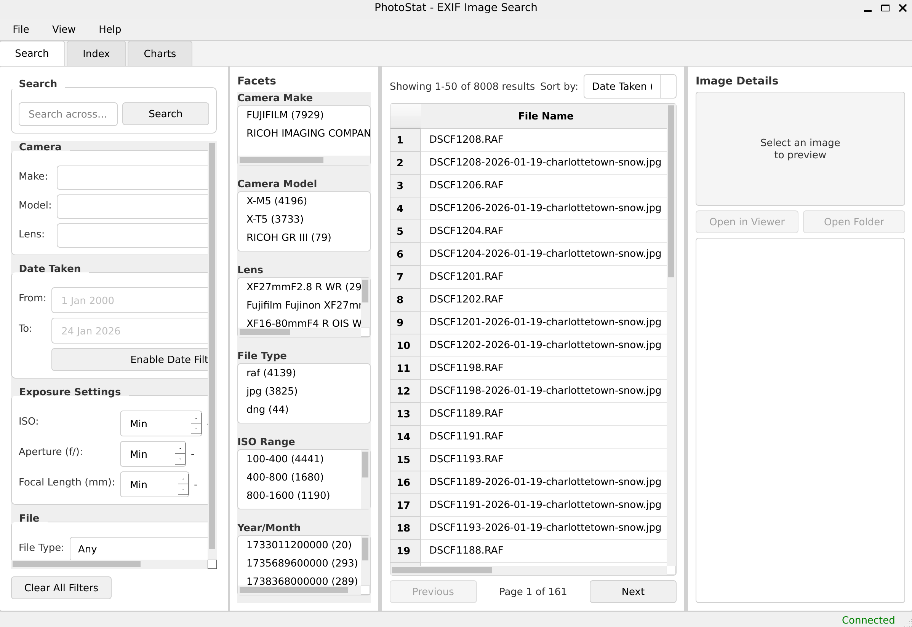

# PhotoStat - EXIF Image Search

A desktop application for indexing and searching image EXIF metadata using OpenSearch.



## Features

- **Full-text search** across all EXIF metadata fields
- **Faceted filtering** by camera make, model, lens, ISO, date, and file type
- **Batch indexing** of image directories with recursive scanning
- **Visual charts** showing camera usage, exposure settings, and photo timelines
- **GPS location mapping** for geotagged photos
- **RAW file support** with embedded thumbnail extraction
- **Resizable panels** for customizable workspace layout
- **Persistent settings** including window size and indexed directories

## Supported Image Formats

- Standard formats: JPEG, PNG, TIFF, GIF, BMP, WebP
- RAW formats: CR2, CR3, NEF, ARW, ORF, RW2, DNG, RAF, PEF, and more

## Quick Start

1. Install dependencies (see [Installation Guide](docs/INSTALLATION.md))
2. Start OpenSearch
3. Run the application:
   ```bash
   python3 main.py
   ```
4. Add directories to index in the **Index** tab
5. Search your photos in the **Search** tab

## Documentation

- [Installation Guide](docs/INSTALLATION.md) - Complete setup instructions
- [User Guide](docs/USER_GUIDE.md) - How to use PhotoStat

## Technology Stack

- **GUI**: Python 3.11+ with PyQt6
- **EXIF Extraction**: ExifTool via pyexiftool
- **Search Backend**: OpenSearch
- **Charts**: Matplotlib

## License

MIT License
