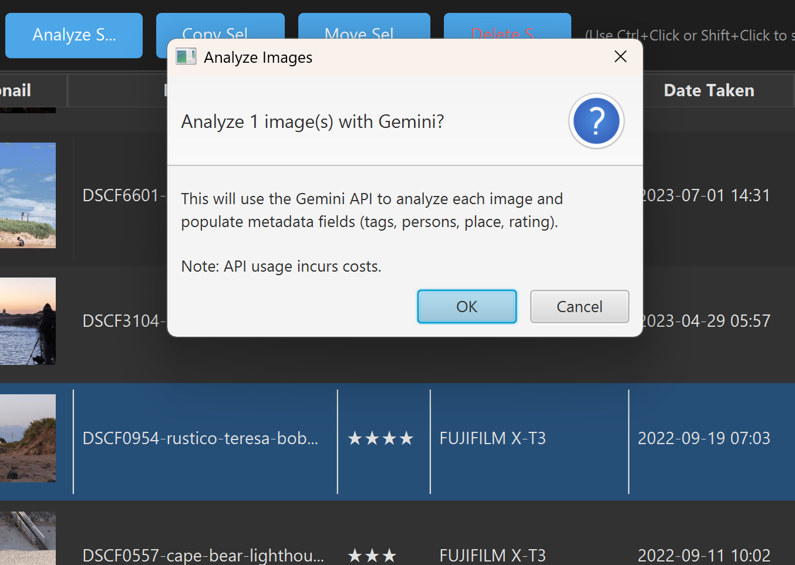

# AI Image Analysis

PhotoStat can automatically analyze your images using AI vision capabilities to populate metadata fields. This guide covers setup, usage, and the command-line interface for batch processing.

## Table of Contents

- [Overview](#overview)
- [Configuring AI Providers](#configuring-ai-providers)
  - [Choosing a Provider](#choosing-a-provider)
  - [Configuring Claude (Anthropic)](#configuring-claude-anthropic)
  - [Configuring Gemini (Google)](#configuring-gemini-google)
  - [Configuring Ollama (Local)](#configuring-ollama-local)
  - [Configuring Moondream (Local)](#configuring-moondream-local)
  - [API Costs](#api-costs)
- [Using AI Analysis in the GUI](#using-ai-analysis-in-the-gui)
- [Analysis Caching](#analysis-caching)
- [Customizing the Analysis Prompt](#customizing-the-analysis-prompt)
- [Rating Scale](#rating-scale)
- [Command-Line Interface (CLI)](#command-line-interface-cli)
  - [Basic Usage](#basic-usage)
  - [CLI Options](#cli-options)
  - [Examples](#examples)
  - [Running in Background](#running-in-background)
  - [Token Usage and Cost Tracking](#token-usage-and-cost-tracking)
- [AI Image Generation (Luma)](#ai-image-generation-luma)
- [Troubleshooting](#troubleshooting)

---

## Overview

Four AI providers are supported:

- **Claude** (Anthropic) - High-quality analysis with excellent scene understanding
- **Gemini** (Google) - Cost-effective alternative with fast processing
- **Ollama** (Local) - Free, offline analysis using locally-hosted vision models via OpenAI-compatible API
- **Moondream** (Local) - Free, offline analysis using a local 2B-parameter vision model

**What the AI Analyzes:**

| Field | Description | Examples |
|-------|-------------|----------|
| **Tags** | Photography style, subjects, mood, technical aspects, **and descriptions of any people visible** | "Portrait", "Landscape", "Black and White", "Bokeh", "elderly man", "woman in red dress" |
| **Place** | Location if identifiable | "Beach", "Restaurant", "Central Park" |
| **Rating** | Quality rating from * to ***** | Based on composition, sharpness, artistic value |

> **Note on people:** AI analysis does **not** populate the `persons` field directly. Descriptive phrases like "elderly man" or "woman in red dress" are written to `tags` instead, so the `persons` field (which maps to the standard `Iptc4xmpExt:PersonInImage` in XMP sidecars) stays reserved for actual *named* people from face recognition or manual entry. This keeps PhotoStat's XMP output semantically compatible with Lightroom, Bridge, digiKam, and other tools that read PersonInImage.

---

## Configuring AI Providers

### Choosing a Provider

| Provider | Pros | Cons |
|----------|------|------|
| **Claude** | Excellent scene understanding, detailed descriptions | Higher cost, requires API key |
| **Gemini** | Very cost-effective, fast processing | May be less detailed, requires API key |
| **Ollama** | Free, no API key, works offline, many model choices | Requires GPU for usable speed, quality varies by model |
| **Moondream** | Free, no API key, works offline, private | Slower (~5-15s/image on CPU), less detailed than cloud models |

### Configuring Claude (Anthropic)

**Getting an API Key:**

1. Visit [Anthropic Console](https://console.anthropic.com/)
2. Create an account or sign in
3. Navigate to **API Keys**
4. Click **Create Key** and copy the key

**Setup in PhotoStat:**

1. Open **File > Settings**
2. Navigate to the **AI Analysis** tab
3. Select **Claude** as the provider
4. Enter your **API Key** (starts with `sk-ant-...`)
5. Select a **Model**:

   | Model | Description |
   |-------|-------------|
   | claude-sonnet-4-20250514 | Fast, cost-effective (recommended) |
   | claude-opus-4-20250514 | Most capable, higher cost |
   | claude-3-5-sonnet-20241022 | Previous generation Sonnet |
   | claude-3-5-haiku-20241022 | Fastest, lowest cost |

6. Click **Test API Key** to verify
7. Click **OK** to save

### Configuring Gemini (Google)

**Getting an API Key:**

1. Visit [Google AI Studio](https://aistudio.google.com/)
2. Sign in with your Google account
3. Click **Get API Key**
4. Create a new API key and copy it

**Setup in PhotoStat:**

1. Open **File > Settings**
2. Navigate to the **AI Analysis** tab
3. Select **Gemini** as the provider
4. Enter your **API Key**
5. Select a **Model**:

   | Model | Description |
   |-------|-------------|
   | gemini-2.0-flash | Latest, fastest (recommended) |
   | gemini-1.5-flash | Previous generation, very fast |
   | gemini-1.5-pro | Most capable, slower |

6. Click **Test API Key** to verify
7. Click **OK** to save

### Configuring Ollama (Local)

Ollama lets you run open-source vision models locally on your machine. PhotoStat connects to Ollama's OpenAI-compatible API endpoint, so it also works with other services that expose the same API (e.g., LM Studio, LocalAI, vLLM).

**Prerequisites:**

- A machine with a GPU (NVIDIA, AMD, or Apple Silicon) is strongly recommended
- ~4-8 GB disk space depending on the model

**Installing Ollama:**

1. Download and install Ollama from [ollama.com](https://ollama.com/)

   | Platform | Installation |
   |----------|-------------|
   | **Windows** | Download the installer from [ollama.com/download](https://ollama.com/download) |
   | **macOS** | Download from [ollama.com/download](https://ollama.com/download) or `brew install ollama` |
   | **Linux** | `curl -fsSL https://ollama.com/install.sh \| sh` |

2. Verify Ollama is running:
   ```bash
   ollama --version
   ```

**Pulling a Vision Model:**

You need a model that supports image/vision input. Pull one of the recommended models:

```bash
# LLaVA — good general-purpose vision model (~4.7 GB)
ollama pull llava

# Llama 3.2 Vision — newer, strong performance (~6 GB)
ollama pull llama3.2-vision

# MiniCPM-V — lightweight alternative (~3 GB)
ollama pull minicpm-v
```

| Model | Size | Description |
|-------|------|-------------|
| `llava` | ~4.7 GB | Good general-purpose vision model, reliable JSON output |
| `llama3.2-vision` | ~6 GB | Meta's latest vision model, strong scene understanding |
| `minicpm-v` | ~3 GB | Lightweight, faster on lower-end hardware |

> **Note:** You can use any Ollama model that supports vision. Browse available models at [ollama.com/search](https://ollama.com/search) and filter by "Vision".

**Verify the Model Works:**

```bash
# Start Ollama if not already running
ollama serve

# Test with a simple prompt
ollama run llava "Describe this image" </path/to/test-image.jpg
```

**Setup in PhotoStat:**

1. Open **File > Settings**
2. Navigate to the **AI Analysis** tab
3. Select **Ollama** as the provider
4. Configure the settings:

   | Setting | Default | Description |
   |---------|---------|-------------|
   | **Base URL** | `http://localhost:11434/v1` | Ollama's OpenAI-compatible endpoint. Change the host/port if Ollama runs on a different machine |
   | **API Key** | (empty) | Optional. Not needed for local Ollama, but required for some remote OpenAI-compatible services |
   | **Model** | `llava` | The vision model to use. Must already be pulled via `ollama pull` |

5. Click **Test** to verify the connection
6. Click **OK** to save

**Using with Other OpenAI-Compatible Services:**

PhotoStat's Ollama provider works with any service that exposes the OpenAI `/v1/chat/completions` endpoint with vision support. Examples:

| Service | Base URL | API Key |
|---------|----------|---------|
| **Ollama** (local) | `http://localhost:11434/v1` | Not required |
| **LM Studio** (local) | `http://localhost:1234/v1` | Not required |
| **LocalAI** (local) | `http://localhost:8080/v1` | Not required |
| **vLLM** (local/remote) | `http://localhost:8000/v1` | Depends on config |
| **OpenRouter** (cloud) | `https://openrouter.ai/api/v1` | Required |

**Performance:**

| Hardware | Speed (per image) |
|----------|-------------------|
| CPU only | Minutes (not recommended) |
| NVIDIA GPU (8+ GB VRAM) | ~3-10 seconds |
| Apple Silicon (M1/M2/M3/M4) | ~3-10 seconds |

**Limitations:**

- Analysis quality depends heavily on the model — local models are generally less accurate than Claude or Gemini at structured JSON output
- Models must support vision/image input — text-only models will not work
- First run for a model requires downloading it (several GB)
- GPU with sufficient VRAM is strongly recommended for usable performance
- Some models may occasionally return malformed JSON, causing analysis failures

### Configuring Moondream (Local)

Moondream is a free, local AI model that runs entirely on your machine. No API key or internet connection required.

**Prerequisites:**

- Python 3.10+ (moondream2's model code uses syntax requiring Python 3.10+)
- ~2 GB disk space (for model download on first run)
- ~2 GB RAM (CPU mode) or CUDA-capable GPU for faster processing

**Installation:**

```bash
pip install "transformers>=4.51,<5" torch Pillow accelerate
```

> **Note:** On Windows, if the quoted version constraint causes issues, use: `pip install transformers==4.51.3 torch Pillow accelerate`

**GPU Acceleration (Recommended):**

The default `pip install torch` installs a CPU-only version. GPU acceleration is **strongly recommended** — CPU mode takes minutes per image, while GPU mode takes a few seconds.

To install PyTorch with NVIDIA CUDA support:

```bash
pip install torch --force-reinstall --index-url https://download.pytorch.org/whl/cu124
```

> **Note:** Use `cu124` for CUDA 12.4 or `cu118` for CUDA 11.8. Check your CUDA version with `nvidia-smi`. This is a ~2.5 GB download.

To verify GPU is detected, click **Test** in the Moondream settings — it should report `"device": "cuda"` instead of `"device": "cpu"`.

**Setup in PhotoStat:**

1. Open **File > Settings**
2. Navigate to the **AI Analysis** tab
3. Select **Moondream** as the provider
4. Set **Python Path** if not using the default `python3`
5. Click **Test** to verify the setup — check that it reports `cuda` for GPU
6. Click **OK** to save

**Performance:**

| Hardware | Speed (per image) |
|----------|-------------------|
| CPU only | Minutes (not recommended) |
| NVIDIA GPU (CUDA) | ~1-3 seconds |

**Limitations:**

- Less detailed analysis than Claude or Gemini
- Single-threaded only (one image at a time)
- First run downloads the model (~1.5 GB)
- GPU (CUDA) strongly recommended for usable performance

### API Costs

| Provider | Cost Level | Best For |
|----------|------------|----------|
| Ollama | Free | Privacy-sensitive, offline, flexible model choices |
| Moondream | Free | Privacy-sensitive, offline, no budget |
| Claude Haiku | Low | Large batches, basic tagging |
| Gemini Flash | Very Low | Cost-sensitive batch processing |
| Claude Sonnet | Medium | Balanced quality and cost |
| Gemini Pro | Medium | Detailed analysis |
| Claude Opus | High | Maximum quality |

Monitor usage:
- Claude: [console.anthropic.com](https://console.anthropic.com/)
- Gemini: [aistudio.google.com](https://aistudio.google.com/)
- Ollama: Free, no usage tracking needed
- Moondream: Free, no usage tracking needed

---

## Using AI Analysis in the GUI

1. **Select images** in the search results (use Ctrl+Click or Shift+Click for multiple)

2. Click **Analyze Selected** in the toolbar above the results

   

3. **Confirm** the analysis - you'll see how many images will be processed

4. **Monitor progress** - a progress dialog shows:
   - Progress bar with completion percentage
   - Current image count (X of Y)
   - Current file being analyzed
   - Error count during processing
   - **Cancel** button to stop after the current image

   

5. When complete, a summary shows successes, failures, and any errors

6. Results are **automatically saved** to OpenSearch and sidecar files

**Notes:**
- Only JPG, PNG, GIF, and WebP images are supported for analysis
- RAW files cannot be analyzed directly
- API usage incurs costs - each image uses API credits
- Large batches may take several minutes to process

---

## Analysis Caching

PhotoStat caches analysis results to avoid redundant API calls and reduce costs:

- An `analysisHash` is stored in the sidecar file after each analysis
- The hash combines: provider + model + prompt + image path + file size + modification time
- When re-analyzing, images with matching hashes are skipped
- The progress dialog shows "Cached (skipped)" count for unchanged images
- Cache is invalidated when you:
  - Switch AI providers (Claude / Gemini / Ollama / Moondream)
  - Change the model in settings
  - Modify the analysis prompt in config.json
  - Edit or replace the image file
- **Batch rename preserves the cache.** Renaming a file would otherwise invalidate the hash because the path is part of it. The Rename... action checks each file's cache validity *before* renaming and refreshes the hash at the new path after, so previously-analyzed files are not re-billed

---

## Customizing the Analysis Prompt

You can customize how the AI analyzes your images in two ways:

**Via Settings UI:**

1. Open **File > Settings**
2. Navigate to the **AI Analysis** tab
3. Scroll down to the **Analysis Prompt** section
4. Edit the prompt text
5. Click **OK** to save
6. Use **Reset to Default** to restore the built-in prompt

**Via config.json:**

Edit the prompt directly in `~/.photostat/config.json`:

```json
{
  "claude": {
    "api_key": "sk-ant-...",
    "model": "claude-sonnet-4-20250514",
    "analysis_prompt": "Your custom prompt here..."
  }
}
```

Changing the prompt will invalidate the cache, causing all images to be re-analyzed on next run.

### Picking Up an Updated Default Prompt

> **Important:** When you first run PhotoStat, the current default prompt is copied into your `config.json` as a literal string. From that point on, PhotoStat reads your stored prompt — *not* the latest built-in default. This means that when a new release ships with an improved default prompt (for example, to change how people are described), existing installations keep using the old copy until you explicitly refresh it.
>
> To pick up a new default prompt after upgrading:
>
> 1. Open **File > Settings > AI Analysis**
> 2. Click **Reset to Default** in the **Analysis Prompt** section
> 3. Click **OK** to save
>
> **Trade-off:** Doing this will change the prompt string used in the cache hash, so every previously analyzed image will be re-processed on the next `--analyze` run. On paid providers (Claude, Gemini) that's a real API cost, so only reset when you're ready to re-analyze — or when you specifically want the new default's behavior.
>
> If you're happy with your current results and not specifically chasing the new default, you can safely leave your stored prompt alone. New images added after an upgrade will still be analyzed with your (possibly older) prompt, which is fine.

---

## Rating Scale

| Rating | Meaning |
|--------|---------|
| * | Poor - significant technical issues, bad composition |
| ** | Below average - noticeable issues, weak composition |
| *** | Average - decent execution, standard composition |
| **** | Good - strong composition, good technique, visually appealing |
| ***** | Excellent - exceptional composition, masterful technique |

---

## Command-Line Interface (CLI)

PhotoStat includes a CLI mode for batch image analysis that can run in the background without tying up the GUI.

> **Note:** The CLI requires the cross-platform JAR (`photostat-java-*-executable.jar`) and Java 21+. The native installers (MSI/DMG) are for the GUI only.

### Basic Usage

```bash
# Show help
java -jar photostat-java-2.3.0-executable.jar --help

# Show CLI analysis help
java -jar photostat-java-2.3.0-executable.jar --analyze --help

# Run analysis on configured directories
java -jar photostat-java-2.3.0-executable.jar --analyze

# Preview what would be analyzed (no API calls)
java -jar photostat-java-2.3.0-executable.jar --analyze --dry-run
```

### CLI Options

| Option | Description |
|--------|-------------|
| `--analyze` | Run batch analysis mode |
| `--dir <path>` | Analyze specific directory (overrides config) |
| `--provider <name>` | Use 'claude', 'gemini', 'ollama', or 'moondream' (overrides config) |
| `--parallel <n>` | Run n parallel analyses (1-8, default: 1) |
| `--dry-run` | Show what would be analyzed without making API calls |
| `--force` | Re-analyze all images, ignoring cache |
| `--quiet, -q` | Minimal output |
| `--no-progress` | Disable progress updates |
| `--help, -h` | Show help |

### Examples

```bash
# Analyze with Gemini instead of configured provider
java -jar photostat-java-2.3.0-executable.jar --analyze --provider gemini

# Analyze with Ollama (free, local)
java -jar photostat-java-2.3.0-executable.jar --analyze --provider ollama

# Analyze with Moondream (free, local)
java -jar photostat-java-2.3.0-executable.jar --analyze --provider moondream

# Analyze a specific directory
java -jar photostat-java-2.3.0-executable.jar --analyze --dir /path/to/photos

# Re-analyze everything (ignore cache)
java -jar photostat-java-2.3.0-executable.jar --analyze --force

# Quiet mode for scripts
java -jar photostat-java-2.3.0-executable.jar --analyze --quiet

# Run with 4 parallel threads for faster processing
java -jar photostat-java-2.3.0-executable.jar --analyze --parallel 4
```

### Running in Background

**Windows PowerShell:**

```powershell
Start-Process -NoNewWindow -FilePath java -ArgumentList "-jar", "photostat-java-2.3.0-executable.jar", "--analyze"
```

**Linux/macOS:**

```bash
nohup java -jar photostat-java-2.3.0-executable.jar --analyze > analysis.log 2>&1 &
```

### What the CLI Does

1. Reads configuration from `~/.photostat/config.json`
2. Connects to OpenSearch
3. Scans configured directories for images
4. Checks sidecar files for cached analysis (skips if hash matches)
5. Analyzes uncached images using the configured AI provider
6. Updates OpenSearch with results
7. Writes results to sidecar files

### Output Example

```
PhotoStat CLI - Batch Image Analysis
=====================================
AI Provider: Gemini
Config: /home/user/.photostat/config.json
Parallel Threads: 4

Scanning directories for images...
Found 150 images, 142 supported for analysis.
Skipping 98 cached images, 44 to analyze.

Starting analysis of 44 images using Gemini (4 threads)...

[1/44] Analyzing: IMG_1234.jpg... OK (tags: 8, rating: ****)
[2/44] Analyzing: IMG_1235.jpg... OK (tags: 5, rating: ***)
...

=====================================
Analysis Complete
=====================================
Total:     44
Success:   43
Failed:    1
Time:      1.2 minutes
Avg:       1.6 seconds/image

Token Usage:
  Input:   125,432 tokens
  Output:  8,521 tokens
  Total:   133,953 tokens
Est. Cost: $0.0159
```

### Token Usage and Cost Tracking

The CLI displays token usage and estimated costs for Gemini API calls. This helps you monitor API usage and costs during batch processing. Costs are estimated based on current Gemini pricing:

| Model | Input (per 1M tokens) | Output (per 1M tokens) |
|-------|----------------------|------------------------|
| gemini-2.0-flash | $0.10 | $0.40 |
| gemini-1.5-flash | $0.075 | $0.30 |
| gemini-1.5-pro | $1.25 | $5.00 |

Note: Claude API does not provide token usage in responses, so cost tracking is only available for Gemini.

---

## AI Image Generation (Luma)

PhotoStat can generate new images from your photos using Luma AI's Photon model. Select one or more images as references, provide a text prompt, and Luma creates a new image.

### Prerequisites

You need two API keys:

1. **Luma API key** — for image generation
2. **ImgBB API key** (free) — for temporary image hosting (Luma requires publicly accessible URLs)

### Getting API Keys

**Luma AI:**
1. Visit [Luma AI API](https://lumalabs.ai/dream-machine/api)
2. Create an account or sign in
3. Generate an API key from the dashboard

**ImgBB (free):**
1. Visit [ImgBB API](https://api.imgbb.com/)
2. Sign up for a free account
3. Copy your API key from the dashboard

> **Privacy note:** Reference images are temporarily uploaded to ImgBB with a 10-minute expiration. They are automatically deleted after expiration. Only optimized thumbnails (max 1024px, compressed JPEG) are uploaded, not your original files.

### Setup in PhotoStat

1. Open **File > Settings**
2. Navigate to the **Image Generation** tab
3. Enter your **Luma API Key**
4. Enter your **ImgBB API Key**
5. Click **Test** to verify the Luma connection
6. Optionally configure defaults (output directory, aspect ratio, reference type, weight)
7. Click **OK** to save

### Generating Images

1. **Select images** in the search results (Ctrl+Click or Shift+Click for multiple)
2. Click **Generate Image** in the toolbar, or right-click and select **Generate Image with Luma**
3. In the generation dialog:

   | Option | Description |
   |--------|-------------|
   | **Prompt** | Text description of the image to generate |
   | **Reference Type** | How source images influence generation (see below) |
   | **Aspect Ratio** | Output image dimensions (1:1, 16:9, 9:16, 4:3, 3:4, 21:9, 9:21) |
   | **Reference Weight** | How much influence source images have (0.0 to 1.0) |
   | **Save to** | Output directory for generated images |
   | **Filename** | Auto-generated with timestamp, editable |
   | **Index in OpenSearch** | Optionally add the generated image to your search index |

4. Click **Generate** and wait for completion (typically 10-30 seconds)
5. A preview of the generated image is shown when complete
6. Click **Open File** to view the full-size result, or **Generate Another** to create more

### Reference Types

| Type | Description | Best For |
|------|-------------|----------|
| **Image Reference** | Uses images as content and composition guidance | Creating variations inspired by your photos |
| **Style Reference** | Transfers the visual style from your images | Applying a photo's look/feel to a new scene |
| **Modify Image** | Edits or transforms the source image (single image only) | Making creative modifications to a specific photo |

### Costs

Luma AI charges per generation. Check current pricing at [lumalabs.ai](https://lumalabs.ai/dream-machine/api). ImgBB is free.

---

## Troubleshooting

| Error | Solution |
|-------|----------|
| "API Key Required" | Configure your API key in Settings > AI Analysis |
| "Invalid API key" | Check that the key is correct and active |
| "API error: 429" | Rate limited - wait and try again with fewer images, or use `--parallel` with lower thread count |
| "Analysis failed" | Check internet connection; verify image format is supported |
| "Retrying after rate limit" | The CLI automatically retries with exponential backoff |
| "Ollama base URL or model not configured" | Set the Base URL and Model in Settings > AI Analysis > Ollama Settings |
| Ollama "Connection refused" | Ollama is not running. Start it with `ollama serve` or launch the Ollama app |
| Ollama "Could not parse JSON from response" | The model returned malformed JSON. Try a different model (e.g., `llava` or `llama3.2-vision`) or retry |
| Ollama analysis is very slow | GPU is required for usable performance. Ensure Ollama detects your GPU — check with `ollama ps` |
| "Moondream Python dependencies not found" | Run `pip install "transformers>=4.51,<5" torch Pillow accelerate` |
| "Moondream worker closed before sending ready signal" | Check Python path in settings; ensure moondream is installed for that Python |
| Moondream is very slow | GPU is required for usable performance. Install PyTorch with CUDA: `pip install torch --force-reinstall --index-url https://download.pytorch.org/whl/cu124`. Verify with Test button — should report `cuda` not `cpu` |
| "Configuration Required" (Luma) | Configure both Luma API key and ImgBB API key in Settings > Image Generation |
| "ImgBB upload failed" | Check your ImgBB API key is correct; verify internet connection |
| "Generation request failed: 400" | Check that the Luma API key is valid and your prompt is not empty |
| "Generation timed out" | Luma may be under heavy load; try again later |
