# PhotoStat User Guide

This guide covers the day-to-day usage of PhotoStat for managing and searching your photo collection.

## Table of Contents

- [First Launch](#first-launch)
- [Configuring OpenSearch](#configuring-opensearch)
- [Adding Directories](#adding-directories)
- [Indexing Images](#indexing-images)
- [Searching Your Photos](#searching-your-photos)
- [Using Faceted Navigation](#using-faceted-navigation)
- [Viewing Image Details](#viewing-image-details)
- [Adding Custom Metadata](#adding-custom-metadata)
- [Slideshow Mode](#slideshow-mode)
- [Managing Files](#managing-files)
- [Finding Duplicates](#finding-duplicates)
- [Face Recognition](#face-recognition)
- [Exploring Charts](#exploring-charts)
- [GPS Map](#gps-map)
- [Thumbnail Cache](#thumbnail-cache)
- [Cloud Upload](#cloud-upload)
- [Sidecar Files](#sidecar-files)
- [Large Collections](#large-collections)
- [Dark Theme](#dark-theme)
- [Enabling Logging](#enabling-logging)

---

## First Launch

When you first launch PhotoStat, you'll see the main window with six tabs:

- **Search** - Find and browse your indexed photos
- **Index** - Manage directories and run indexing
- **Duplicates** - Find and manage duplicate images
- **Faces** - Face detection, clustering, and person naming
- **Map** - Interactive map of geotagged photos
- **Charts** - View visualizations of your collection

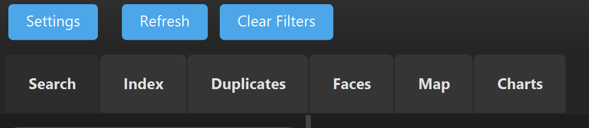

---

## Configuring OpenSearch

1. Click **File > Settings** or the **Settings** button

   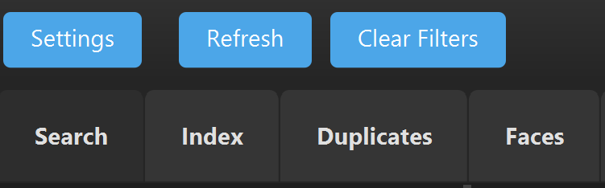

2. In the Settings dialog, configure your OpenSearch connection:

   | Setting | Default | Description |
   |---------|---------|-------------|
   | Host | localhost | OpenSearch server hostname |
   | Port | 9200 | OpenSearch HTTP port |
   | Use SSL | No | Enable for HTTPS connections |
   | Index Name | photostat | Name of the search index |

   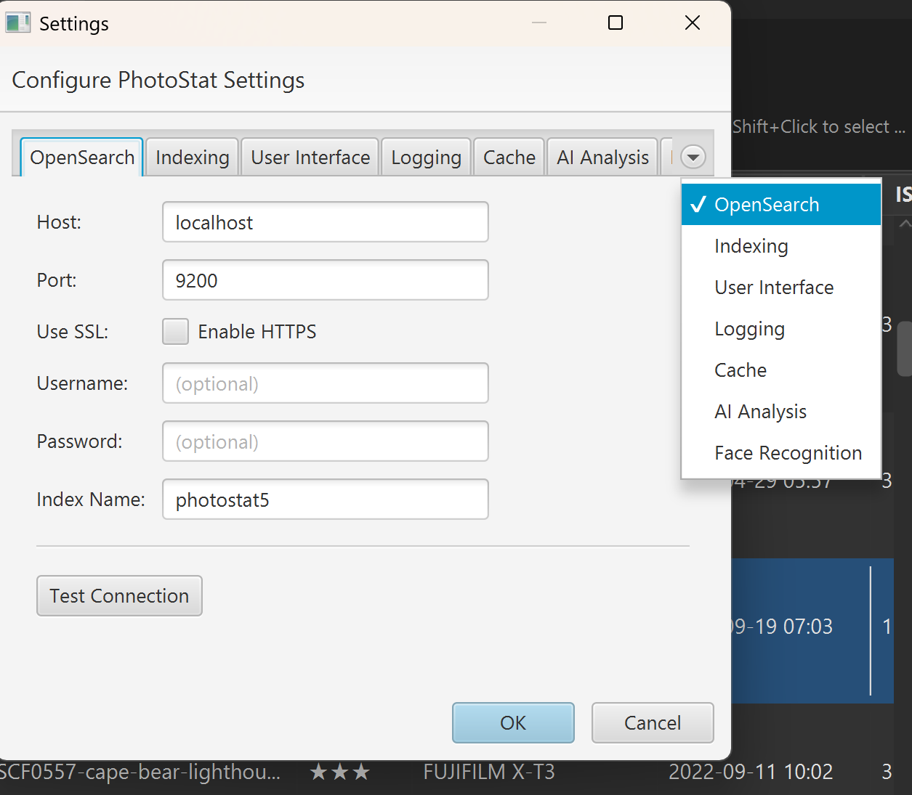

3. Click **Test Connection** to verify connectivity

4. Click **Save** to apply changes

---

## Adding Directories

1. Navigate to the **Index** tab

   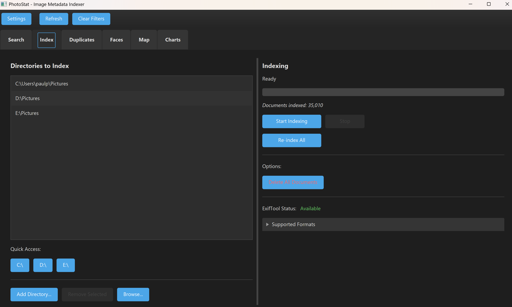

2. Click **Add Directory** button

3. In the directory browser:
   - Navigate to your photo folder
   - Or use the drive buttons for quick access
   - Click **Select** when you've chosen your folder

   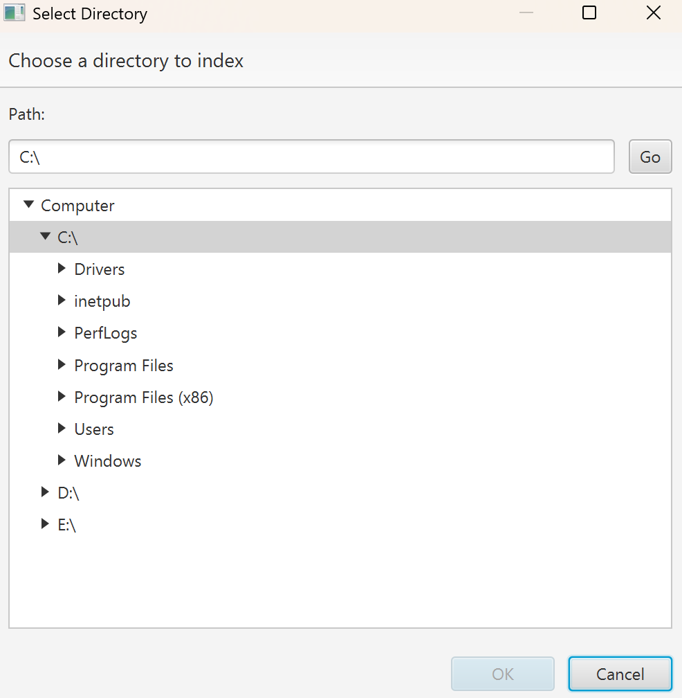

4. The directory will appear in the list with its path

5. Repeat to add more directories as needed

**Tips:**
- Add your main photo library folder (e.g., `Pictures`, `Photos`)
- You can add network drives if they're mounted
- Subdirectories are automatically included

---

## Indexing Images

1. In the **Index** tab, verify your directories are listed

2. Click **Start Indexing**

3. A **directory selection dialog** appears showing all configured directories with checkboxes (all checked by default). Choose which directories to index:
   - Use **Select All** / **Deselect All** to toggle all directories at once
   - Check or uncheck individual directories as needed
   - The **Start Indexing** button is disabled until at least one directory is checked
   - Click **Cancel** to abort without indexing

   This is useful when you have many directories configured but only need to re-scan one or two.

4. Watch the progress bar and status messages:
   - "Scanning directories..." - Finding image files
   - "Indexing: filename.jpg" - Processing individual files
   - "Indexed X of Y files" - Progress update

   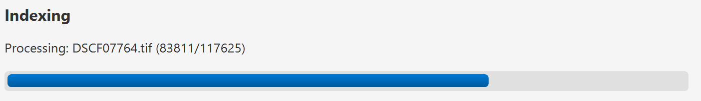

4. Wait for "Indexing complete" message

**Configuring File Types:**

You can choose which file types to index in **File > Settings > Indexing**. Each supported extension has a checkbox — uncheck TIFF and RAW formats if you want faster indexing of just standard image formats.

**Notes:**
- Indexing runs in the background - you can switch tabs
- Large collections may take several minutes
- Only new/modified files are re-indexed on subsequent runs
- Click **Stop Indexing** to cancel if needed
- TIFF and RAW files are slower to index and require ExifTool

---

## Searching Your Photos

1. Navigate to the **Search** tab

   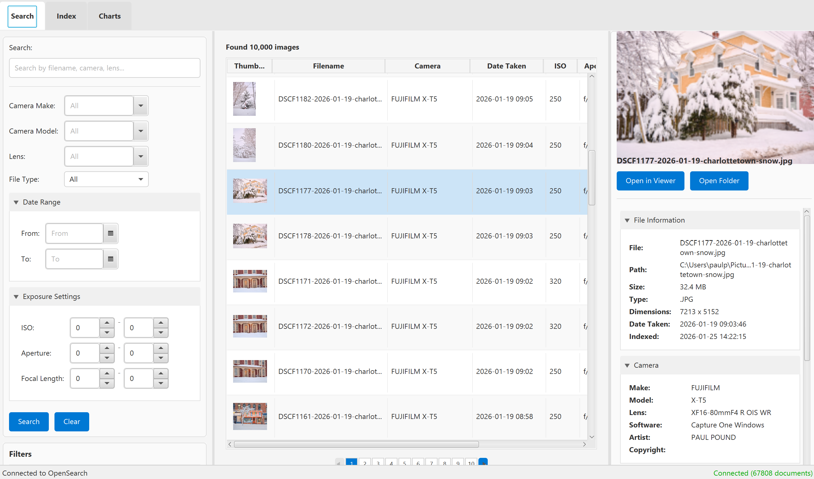

2. **Text Search**: Type keywords in the search box
   - Camera names: "Canon", "Nikon D850"
   - Lens info: "50mm", "70-200"
   - File names: "vacation", "2023"
   - Any EXIF field value

3. **Filter Options**:

   | Filter | Description |
   |--------|-------------|
   | Camera Make | Filter by manufacturer with autocomplete (Canon, Nikon, Sony...) |
   | Camera Model | Filter by specific camera model with autocomplete |
   | Lens | Filter by lens used with autocomplete |
   | File Type | JPEG, PNG, RAW formats |
   | Date Range | Photos taken between dates |
   | ISO Range | Filter by ISO sensitivity |
   | Aperture | Filter by f-stop value |
   | Person | Multi-select with chips - filter by tagged people |
   | Place | Multi-select with chips - filter by location |
   | Tags | Multi-select with chips - filter by custom tags |
   | Rating | Filter by quality rating with autocomplete |

   **Autocomplete**: Camera, lens, and rating fields support type-ahead filtering - start typing to narrow down options.

   **Multi-Select Chips**: Person, Place, and Tag filters display selected values as removable chips, allowing you to filter by multiple values simultaneously (AND logic - all selected values must match).

   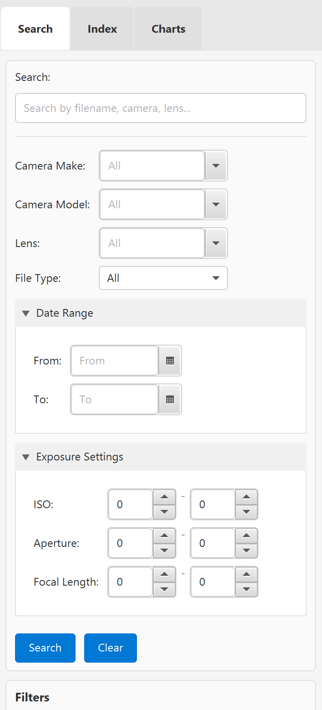

4. Click **Search** or press Enter

5. Results appear in the table below with:
   - Thumbnail preview
   - Filename
   - Camera info
   - Date taken
   - Exposure settings

   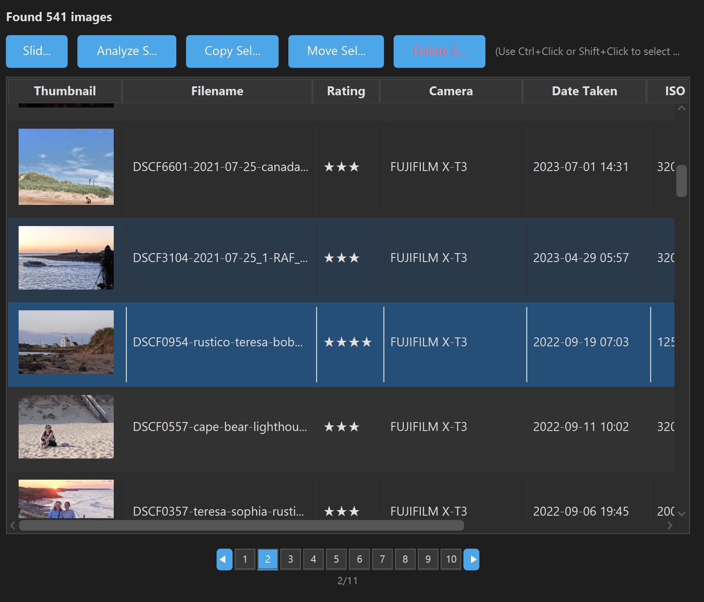

---

## Using Faceted Navigation

The **Facets Panel** on the left shows aggregated counts for quick filtering:

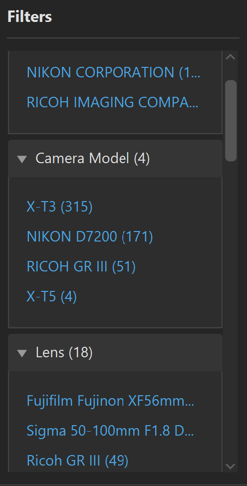

**Available Facets:**
- **Camera Make** - Click to filter by manufacturer
- **Camera Model** - Click to filter by specific model
- **Lens Model** - Click to filter by lens
- **Software** - Click to filter by editing software
- **File Type** - Click to filter by format
- **ISO Range** - Click to filter by ISO bracket
- **Year/Month** - Click to filter by time period
- **Persons** - Click to filter by tagged people
- **Places** - Click to filter by location name
- **Tags** - Click to filter by custom tags

**How to Use:**
1. Click any facet value to apply that filter
2. The search results update immediately
3. Other facets update to show remaining options
4. For Person, Place, and Tag facets: clicking adds to existing selections (displayed as chips)
5. Remove individual filters by clicking the X on chips, or use Clear Filters to reset all

---

## Viewing Image Details

1. Click on any row in the search results

2. The **Detail Panel** on the right shows:

   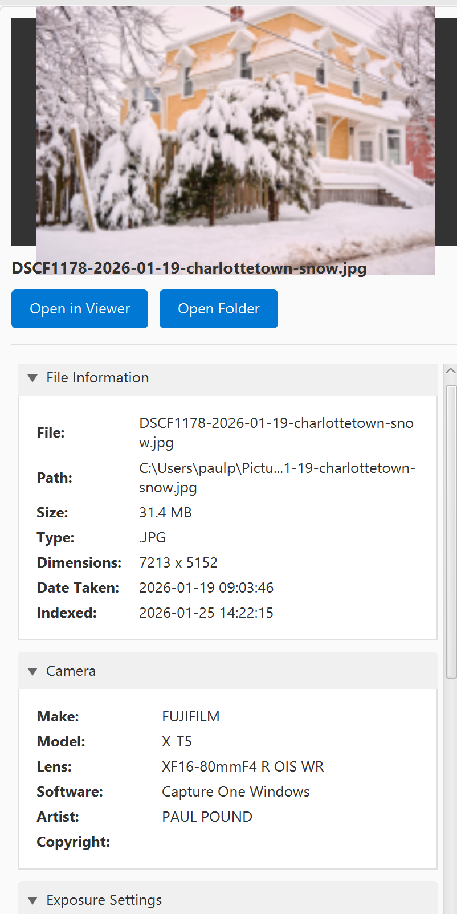

   **Preview Image** - Larger thumbnail of the selected photo

   **File Information:**
   - Full file path
   - File size
   - Image dimensions
   - Date taken

   **Camera Information:**
   - Make and model
   - Lens used
   - Software/editor

   **Exposure Settings:**
   - ISO
   - Aperture (f-stop)
   - Shutter speed
   - Focal length

   **GPS Location** (if available):
   - Latitude/Longitude
   - "Open in Google Maps" link

3. **Action Buttons:**
   - **Open in Viewer** - Opens the image in your default photo viewer
   - **Open Folder** - Opens the containing folder in file explorer

---

## Adding Custom Metadata

You can add your own metadata to photos for better organization:

1. **Select an image** in the search results

2. In the **Detail Panel**, find the **Custom Metadata** section:

   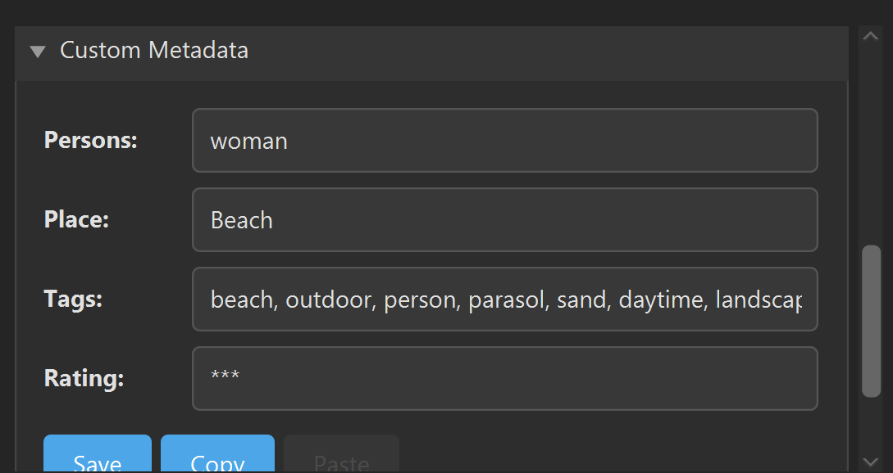

3. **Add metadata:**

   | Field | Description | Example |
   |-------|-------------|---------|
   | **Persons** | Names of people in the photo (comma-separated) | "John, Jane, Bob" |
   | **Place** | Location name | "Central Park, NYC" |
   | **Tags** | Custom tags (comma-separated) | "vacation, family, summer" |
   | **Rating** | Quality rating using asterisks | "***" (3 stars) |

4. Click **Save Metadata** to save changes

5. The search will automatically refresh

**Keyboard Rating Shortcuts:**

For fast photo culling, you can rate images directly from the results table using keyboard shortcuts:

1. Click the results table to give it focus
2. Use **Arrow Up/Down** to navigate between images
3. Press **1-5** to set a rating (1 = \*, 2 = \*\*, ..., 5 = \*\*\*\*\*)
4. Press **0** to clear the rating

Ratings are saved immediately to OpenSearch and sidecar files — no need to click Save. The Rating column in the table and the Detail Panel update instantly. These shortcuts only work when the results table has focus, so typing in the search box or metadata fields is unaffected.

**Using Custom Metadata:**
- Search for names, places, or tags in the search box
- Use the **Persons**, **Places**, and **Tags** facets to filter
- Use the filter dropdowns in the **Custom Metadata** section of the search panel

**Copy & Paste Metadata:**

You can copy custom metadata from one image and paste it to others:

1. Select an image with the metadata you want to copy
2. Click **Copy** in the Custom Metadata section
3. Select another image
4. Click **Paste** to fill in the fields
5. Click **Save** to apply the changes

This is useful when multiple photos share the same people, location, or tags.

---

## Slideshow Mode

PhotoStat includes a full-screen slideshow for browsing your current search results with keyboard navigation and quick rating — ideal for photo culling workflows.

### Launching the Slideshow

- Click the **Slideshow** button in the results toolbar, or
- Press **F5** when the results table has focus

The slideshow opens full-screen starting from the currently selected image (or the first result if none is selected).

### Keyboard Controls

| Key | Action |
|-----|--------|
| **Right / Down / Space / Page Down** | Next image |
| **Left / Up / Page Up** | Previous image |
| **Home** | Jump to first image |
| **End** | Jump to last image |
| **1-5** (digit or numpad) | Set rating (1 = ★, 5 = ★★★★★) |
| **0** (digit or numpad) | Clear rating |
| **I** | Toggle HUD info overlay |
| **Delete / Backspace** | Delete current image |
| **Escape** | Exit slideshow |

### HUD Overlay

A semi-transparent info bar appears at the bottom of the screen showing:
- Current rating (gold stars)
- Filename
- EXIF summary (aperture, shutter speed, ISO, focal length)
- Image counter (e.g., "3 / 150")

The HUD auto-hides after 3 seconds and reappears on any key press or mouse movement. Press **I** to pin it on or off.

### Rating in Slideshow

Press **1-5** to rate the current image or **0** to clear the rating. A brief toast notification confirms the rating. Changes are saved immediately to OpenSearch and sidecar files, and the results table updates when you exit the slideshow.

### Deleting Images in Slideshow

Press **Delete** or **Backspace** to delete the current image. A confirmation dialog appears before anything is removed. On confirmation, the image file, its sidecar file, and its index entry are all deleted. The slideshow advances to the next image automatically.

### RAW File Support

Standard image formats (JPEG, PNG, etc.) are loaded at full screen resolution. RAW files (CR2, CR3, NEF, ARW, DNG, etc.) are displayed using embedded preview thumbnails extracted via the thumbnail cache.

---

## Managing Files

You can copy, move, or delete images directly from search results:

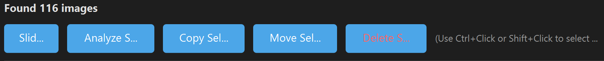

**Selecting Images:**
1. **Single selection** - Click on a row to select one image
2. **Multi-select** - Use Ctrl+Click to add individual images to selection
3. **Range select** - Use Shift+Click to select a range of images

**Available Operations:**

| Operation | Button | Description |
|-----------|--------|-------------|
| **Copy** | Copy Selected... | Copy images to a new directory |
| **Move** | Move Selected... | Move images to a new directory |
| **Upload** | Upload Selected... | Upload images to a cloud remote via rclone |
| **Delete** | Delete Selected | Permanently delete images |

**Copy Images:**
1. Select one or more images
2. Click **Copy Selected...**
3. Choose a destination directory
4. After copying, you'll be asked if you want to index the copied files
   - Click **OK** to add them to the search index
   - Click **Cancel** to skip indexing
5. A summary shows the result and indexing status

**Move Images:**
1. Select one or more images
2. Click **Move Selected...**
3. Choose a destination directory
4. Files are moved and automatically re-indexed at the new location
5. A summary shows the result and indexing status

**Delete Images:**
1. Select one or more images
2. Click **Delete Selected**
3. Confirm the deletion in the warning dialog
4. Files are permanently deleted from disk and removed from the index

**Notes:**
- Sidecar files (`.photostat.json`) are automatically copied/moved/deleted with their images
- Move and delete operations update the search index automatically
- Deleted files cannot be recovered - use with caution!

---

## Finding Duplicates

PhotoStat can detect duplicate images using two methods:

- **Exact Duplicates** - Uses SHA-256 content hashing to find byte-for-byte identical files
- **Visual Duplicates** - Uses perceptual hashing (dHash) to find visually similar images, even if they've been resized, recompressed, or re-exported

### Prerequisites

Hashes are computed during indexing. To populate hash data for your collection:

1. Go to the **Index** tab
2. Click **Re-index All** to recompute hashes for existing images
3. New images indexed going forward will automatically have hashes computed

### Using the Duplicates Tab

1. Navigate to the **Duplicates** tab

2. **Choose a detection mode:**

   | Mode | Description | Best For |
   |------|-------------|----------|
   | **Exact Duplicates** | SHA-256 hash of file bytes | Finding identical copies across drives |
   | **Visual Duplicates** | Perceptual hash of image content | Finding resized, recompressed, or re-exported versions |

3. Click **Scan for Duplicates**

4. The summary shows:
   - Number of duplicate groups found
   - Total number of duplicate images
   - Reclaimable disk space (total size minus one copy per group)

5. **Browse duplicate groups** in the left panel:
   - Each group shows a representative filename and copy count
   - Total size and reclaimable space per group

6. **Review details** by clicking a group:
   - Thumbnail preview of each copy
   - Full file path, size, date taken, and dimensions
   - Checkboxes for selecting files to delete
   - **Double-click** any image to open it in your system's default viewer

7. **Delete duplicates:**
   - Check the copies you want to remove (you cannot select all files in a group)
   - Click **Delete Selected Files**
   - Confirm in the dialog
   - Files are permanently deleted from disk and removed from the index

**Tips:**
- Start with **Exact Duplicates** mode to find safe-to-remove identical copies
- Use **Visual Duplicates** to find images that may differ in resolution or compression
- Always review before deleting — visual duplicates may include intentionally different versions (e.g., edited vs. original)

### CLI Duplicate Finder

You can also find duplicates from the command line:

```bash
# Find exact duplicates (default)
java -jar photostat-java-1.9.11-executable.jar --find-duplicates

# Find visual duplicates
java -jar photostat-java-1.9.11-executable.jar --find-duplicates --mode visual

# Minimal output
java -jar photostat-java-1.9.11-executable.jar --find-duplicates --quiet
```

The CLI outputs duplicate groups with file paths, sizes, dates, and reclaimable space.

---

## Face Recognition

PhotoStat can automatically detect faces in your photos, cluster them by identity, and let you assign names. Named faces become searchable via the Persons facet and text search.

### Prerequisites

Face recognition requires Python with InsightFace:

```bash
# CPU only
pip install insightface onnxruntime

# With GPU acceleration (much faster)
pip install insightface onnxruntime-gpu

# Recommended for better clustering
pip install scikit-learn
```

The InsightFace `buffalo_l` model (~350MB) downloads automatically on first use.

### Using the Faces Tab

1. Navigate to the **Faces** tab

   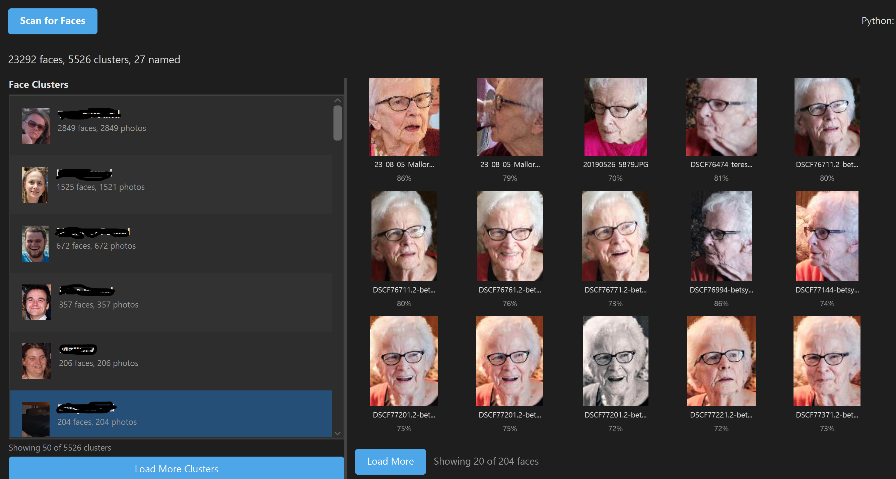

2. The toolbar shows Python status: **Available (GPU)** or **Available (CPU)**

3. Click **Scan for Faces** to start detection:
   - PhotoStat fetches all indexed image paths from OpenSearch
   - Faces are detected using InsightFace with 512-dimensional embeddings
   - Similar faces are clustered together automatically
   - Progress is shown in the summary bar

4. **Browse face clusters** in the left panel:
   - Each cluster shows a representative face thumbnail
   - Person name (or "Unknown #N") and face/photo counts
   - Clusters are sorted by size (most faces first)

5. **Name a person:**
   - Select a cluster in the list
   - Type the person's name in the text field on the right
   - Click **Save Name**
   - The name is saved to OpenSearch and sidecar files for all images in that cluster

6. **Merge clusters:**
   - If two clusters belong to the same person, select one and click **Merge with...**
   - Choose the other cluster from the dialog
   - The clusters are combined and the merged cluster inherits the target's name

7. **Click any face thumbnail** to open the source image in your default viewer

### Incremental Scanning

Face scanning is incremental — only new images are processed on subsequent runs. Previously scanned images are skipped automatically. To rescan everything, use the CLI with `--force`.

### Face Recognition Settings

Configure face recognition in **Settings > Face Recognition**:

| Setting | Default | Description |
|---------|---------|-------------|
| Enable Face Recognition | On | Enable or disable the feature |
| Python Path | `python3` | Path to Python executable |
| Detection Confidence | 0.6 | Minimum confidence for face detection (0.3-0.9) |
| Cluster Threshold | 0.6 | Similarity threshold for clustering (0.3-0.9) |

### CLI Face Detection

For large collections, use the CLI for batch processing with parallel workers:

```bash
# Detect and cluster faces
java -jar photostat-java-1.9.11-executable.jar --detect-faces

# Use 4 parallel Python workers
java -jar photostat-java-1.9.11-executable.jar --detect-faces --parallel 4

# Scan a specific directory (bypasses OpenSearch)
java -jar photostat-java-1.9.11-executable.jar --detect-faces --dir /path/to/photos

# Preview what would be processed
java -jar photostat-java-1.9.11-executable.jar --detect-faces --dry-run

# Rescan all images (ignore previous results)
java -jar photostat-java-1.9.11-executable.jar --detect-faces --force

# Detection only (skip clustering)
java -jar photostat-java-1.9.11-executable.jar --detect-faces --detect-only

# Clustering only (on existing face data)
java -jar photostat-java-1.9.11-executable.jar --detect-faces --cluster-only
```

**Notes:**
- Progress is saved every 500 images; safe to interrupt and resume
- Each parallel worker loads its own model (more RAM needed)
- Face data is stored at `~/.photostat/faces/`

---

## Exploring Charts

Navigate to the **Charts** tab to visualize your collection:

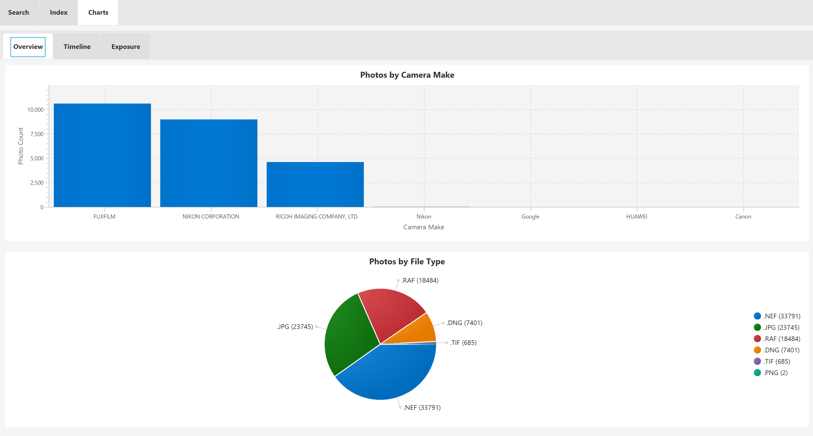

**Available Views:**

1. **Overview**
   - Camera makes bar chart
   - File types pie chart
   - Editing software bar chart

   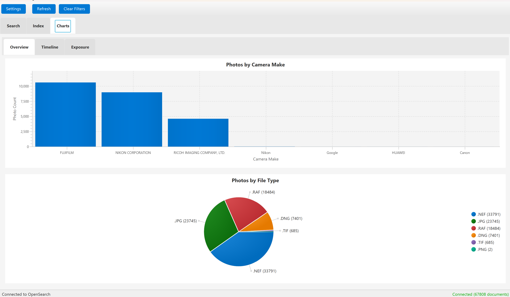

2. **Timeline**
   - Photos by month/year line chart
   - See your photography activity over time

   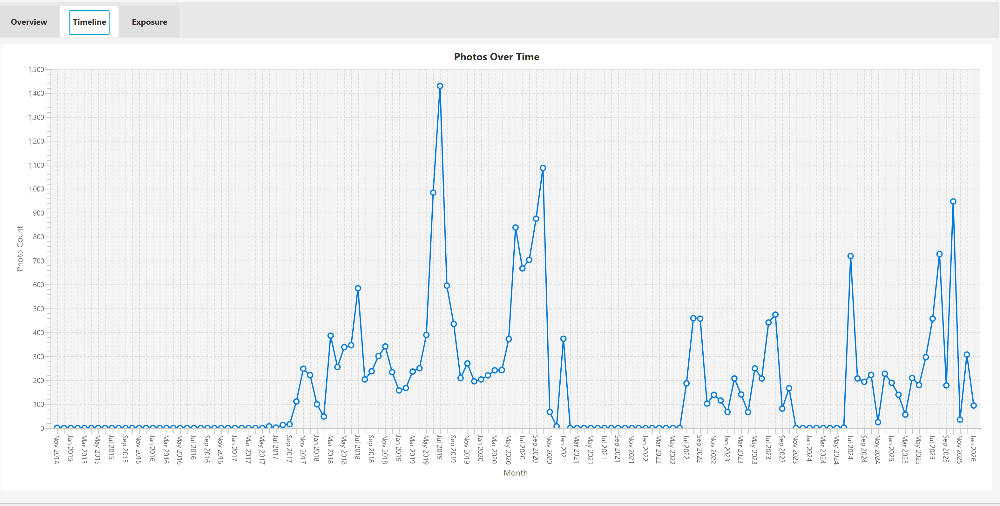

3. **Exposure**
   - ISO distribution histogram
   - Aperture usage chart
   - Focal length distribution

   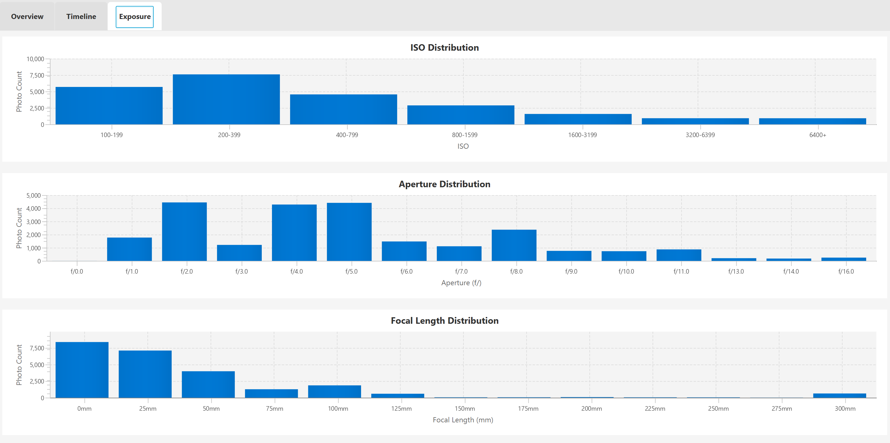

4. **Locations** (if GPS data available)
   - Map plot of photo locations

---

## GPS Map

The **Map** tab provides an interactive map view of all your geotagged photos, powered by OpenStreetMap and Leaflet.js.

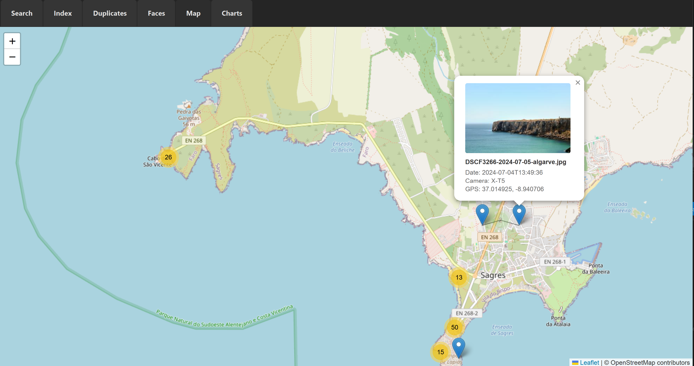

### Accessing the Map

Click the **Map** tab in the main window. The map loads automatically and shows all photos that have GPS coordinates in their EXIF data. A status bar at the bottom displays the total number of geotagged images.

### Cluster View (Zoomed Out)

When zoomed out (zoom level 12 and below), photos are grouped into **clusters** based on geographic proximity:

- **Small blue circles** — fewer than 100 photos in that area
- **Medium orange circles** — 100 to 999 photos
- **Large red circles** — 1,000+ photos

Click any cluster to zoom in and see more detail.

### Photo Markers (Zoomed In)

When zoomed in (zoom level 13+), individual photo markers appear at their exact GPS coordinates. Click a marker to see a popup with:

- Thumbnail preview (if cached)
- Filename
- Date taken
- Camera model
- GPS coordinates

### Navigation

- **Scroll** to zoom in/out
- **Click and drag** to pan the map
- The map automatically fits to your photo locations on first load

---

## Thumbnail Cache

PhotoStat caches generated thumbnails to disk for faster loading on subsequent views.

**Configure Cache Settings:**

1. Open **File > Settings**
2. Navigate to the **Cache** tab
3. Configure options:

   | Setting | Description |
   |---------|-------------|
   | Enable Disk Cache | Turn disk caching on/off |
   | Max Cache Size | Maximum disk space for cache (100-5000 MB) |

4. View cache statistics (file count and size)
5. Click **Refresh Stats** to update the cache statistics
6. Click **Clear Cache** to remove all cached thumbnails
7. Click **Pre-cache Thumbnails** to generate thumbnails in advance

**Pre-caching Thumbnails:**

The Pre-cache Thumbnails feature generates thumbnails for all indexed images:

1. Click **Pre-cache Thumbnails** in the Cache settings
2. A progress dialog shows the caching progress
3. Statistics display: cached, skipped (already cached or unsupported), and failed counts
4. Caching stops automatically when the cache size limit is reached
5. Click **Cancel** to stop early, or **Close** when complete

Pre-caching improves the GUI experience by having thumbnails ready before you browse.

**CLI Pre-caching:**

You can also pre-cache thumbnails from the command line:

```bash
java -jar photostat-java-1.9.11-executable.jar --cache-thumbnails
```

Options:
- `--parallel N` or `-p N` - Number of parallel threads (1-16, default: 4)
- `--dry-run` - Show what would be cached without actually caching
- `--quiet` or `-q` - Minimal output
- `--help` - Show help message

Examples:
```bash
# Use default 4 threads
java -jar photostat-java-1.9.11-executable.jar --cache-thumbnails

# Use 8 threads for faster processing
java -jar photostat-java-1.9.11-executable.jar --cache-thumbnails --parallel 8

# Use 2 threads with minimal output
java -jar photostat-java-1.9.11-executable.jar --cache-thumbnails -p 2 --quiet
```

**Cache Location:** `~/.photostat/cache/`

**How It Works:**
- Thumbnails are saved as JPEG files with hashed filenames
- Cache key includes file path, modification time, and thumbnail size
- If source image is modified, a new thumbnail is generated automatically
- When cache exceeds max size, oldest thumbnails are removed (LRU eviction)

---

## Cloud Upload

PhotoStat can upload your photos to cloud storage via [rclone](https://rclone.org/), which supports 70+ providers including Google Photos, Amazon S3, Dropbox, OneDrive, and more.

### Prerequisites

1. **Install rclone:** Download from [rclone.org/downloads](https://rclone.org/downloads/)
2. **Configure a remote:** Run `rclone config` in a terminal to set up your cloud provider

### Configuration

1. Open **Settings** and navigate to the **Cloud Upload** tab
2. Configure the following:

   | Setting | Description | Example |
   |---------|-------------|---------|
   | **rclone Path** | Path to rclone executable | `rclone` (if on PATH) |
   | **Remote Name** | Name of your configured rclone remote | `gphotos` |
   | **Remote Path** | Destination path on the remote | `upload` or `album/MyAlbum` |
   | **Upload Directories** | Local directories to upload from | `C:\Pictures\NewImages` |

3. Use the **Test** button to verify rclone is installed
4. Use **List Remotes** to see available remotes from your rclone config
5. Use **Test Connection** to verify the remote is accessible
6. Click **OK** to save

**Upload directories are separate from indexing directories.** This lets you index your entire photo library but only upload specific folders (e.g., newly processed images).

### Google Drive vs Google Photos

rclone supports both Google Drive and Google Photos as separate remote types. They have different behaviors:

**Google Drive** (`drive` remote type):
- **Recommended for most users.** Upload to a specific folder and rclone tracks what's already there — re-running the upload skips files that haven't changed.
- Set **Remote Path** to a folder path (e.g., `Photos/Processed`). The folder is created automatically if it doesn't exist.
- Supports true incremental uploads — only new or modified files are transferred.

**Google Photos** (`google photos` remote type):
- Set **Remote Path** to `upload` (main library) or `album/AlbumName` (specific album). An empty path will not work.
- **Google Photos cannot detect previously uploaded files.** The Google Photos API does not allow rclone to list or compare files in the upload target, so every run will re-upload all files. To avoid duplicates, manage your upload directory so it only contains new files (e.g., move files out after uploading, or use a staging folder).
- Google Photos may also re-compress or resize images depending on your Google storage plan.

### Creating a Google OAuth Client ID

rclone includes a default Google OAuth client ID, but it is shared across all rclone users and may be rate-limited by Google. If you experience authentication failures or slow uploads, create your own client ID:

1. Go to the [Google Cloud Console](https://console.cloud.google.com/)
2. Create a new project (or select an existing one)
3. Enable the **Google Drive API** and/or **Google Photos Library API** (depending on which remote type you use)
4. Go to **APIs & Services > Credentials** and create an **OAuth 2.0 Client ID** (application type: Desktop app)
5. When running `rclone config`, enter your client ID and client secret when prompted instead of leaving them blank

### Uploading Selected Images

You can upload specific images directly from search results:

1. **Select images** in the Search tab results (Ctrl+Click or Shift+Click for multiple)
2. Click **Upload Selected...** in the toolbar
3. In the upload dialog:

   | Option | Description |
   |--------|-------------|
   | **Remote** | Choose from your configured rclone remotes |
   | **Remote path** | Destination path on the remote (e.g. `Photos/2024`) |
   | **Skip already uploaded files** | Checked by default — skips files previously uploaded to the selected remote |
   | **Dry run** | Preview what would be uploaded without actually transferring |

4. Click **Upload** to start
5. A progress dialog shows each file being uploaded
6. The summary shows selected, uploaded, and skipped counts

**Duplicate upload prevention:** Each successful upload is recorded in the image's `.photostat.json` sidecar file. On subsequent uploads, files already sent to the same remote are automatically skipped. Uncheck "Skip already uploaded files" to force re-upload. Uploads to a *different* remote are not skipped — the tracking is per-remote.

### Uploading Directories via GUI

1. Click the **Upload to Cloud** button in the toolbar
2. A progress dialog shows each directory being uploaded with rclone output
3. Use the **Cancel** button to abort the upload
4. A summary is shown at completion

### Uploading via CLI

For scripting and scheduling, use the `--rclone-upload` command:

```bash
# Upload all configured directories
java -jar photostat-java-1.9.11-executable.jar --rclone-upload

# Preview what would be uploaded
java -jar photostat-java-1.9.11-executable.jar --rclone-upload --dry-run

# Upload a specific directory (overrides config)
java -jar photostat-java-1.9.11-executable.jar --rclone-upload --dir /path/to/photos

# Minimal output
java -jar photostat-java-1.9.11-executable.jar --rclone-upload --quiet
```

**Incremental uploads:** For most remotes (including Google Drive), rclone only transfers new or changed files. Running the upload multiple times is safe and efficient. **Exception:** Google Photos cannot detect previously uploaded files — see [Google Drive vs Google Photos](#google-drive-vs-google-photos) above.

**Sidecar exclusion:** `.photostat.json` sidecar files are automatically excluded from uploads.

---

## Sidecar Files

Sidecar files allow custom metadata (persons, places, tags) to persist even when rebuilding the search index.

**How It Works:**
- When you save custom metadata, a `.photostat.json` file is created alongside the image
- Example: `IMG_1234.jpg` → `IMG_1234.jpg.photostat.json`
- When re-indexing, PhotoStat reads the sidecar and restores your custom metadata

**Example Sidecar File:**
```json
{
  "persons" : [ "John", "Jane" ],
  "place" : "Central Park",
  "tags" : [ "vacation", "family" ],
  "rating" : "****",
  "cloudUploads" : [ "gphotos", "gdrive" ]
}
```

**Benefits:**
- Custom metadata survives index rebuilds
- Metadata travels with images if files are moved/copied
- Can be backed up alongside photos
- Human-readable JSON format

---

## Large Collections

If you have tens of thousands of images or more, here are some tips to keep PhotoStat running smoothly.

### Indexing Performance

Indexing computes both a **SHA-256 content hash** (for exact duplicate detection) and a **perceptual hash** (for visual duplicate detection) for every image. This hashing is the most time-consuming part of indexing, so initial indexing of a large collection can take a while.

**Increase indexing threads** to speed things up:

1. Open **Settings > Indexing**
2. Raise **Indexing Threads** (default is 4, try 8 or more if your system has the cores)
3. Click **OK** and start indexing

Or edit `~/.photostat/config.json` directly:

```json
{
  "indexing": {
    "indexing_threads": 8,
    "batch_size": 100
  }
}
```

Increasing `batch_size` (default 50) reduces the number of OpenSearch bulk requests, which can also help with large collections.

**Incremental indexing**: After the initial index, subsequent runs only process new or modified files. There's no need to re-index your entire collection each time.

### Managing Directories

Once a directory has been indexed, you can **remove it from the directory list** without losing the indexed data. The images remain searchable in OpenSearch. This is useful if you index photos from an external drive and then disconnect it — your metadata and search results are still available.

To add new images from that directory later, simply re-add it to the directory list and run indexing again. Only the new/changed files will be processed.

### Pre-cache Thumbnails via CLI

Generating thumbnails on the fly while browsing can feel sluggish with very large result sets. Pre-caching builds all thumbnails in advance so browsing is instant.

The CLI is the best way to pre-cache a large collection since it runs in the background without tying up the GUI:

```bash
# Pre-cache with default 4 threads
java -jar photostat-java-1.9.11-executable.jar --cache-thumbnails

# Use 8 threads for faster processing
java -jar photostat-java-1.9.11-executable.jar --cache-thumbnails --parallel 8

# Preview what would be cached
java -jar photostat-java-1.9.11-executable.jar --cache-thumbnails --dry-run
```

Already-cached thumbnails are skipped automatically, so you can re-run this after adding new images.

**Tip**: For very large collections, increase the cache size limit in **Settings > Cache** (default is 500 MB). A collection of 50,000 images typically needs around 2-3 GB of cache space.

### Batch AI Analysis via CLI

Analyzing thousands of images through the GUI is possible but the CLI is better suited for large batches — it supports parallel processing, runs in the background, and provides detailed progress output.

```bash
# Analyze all indexed images (skips already-analyzed ones)
java -jar photostat-java-1.9.11-executable.jar --analyze

# Run 4 analyses in parallel for faster throughput
java -jar photostat-java-1.9.11-executable.jar --analyze --parallel 4

# Use Gemini Flash for cheapest batch processing
java -jar photostat-java-1.9.11-executable.jar --analyze --provider gemini

# Preview what would be analyzed without making API calls
java -jar photostat-java-1.9.11-executable.jar --analyze --dry-run
```

**Cost awareness**: AI analysis incurs API costs per image. For very large collections, consider:
- Use `--dry-run` first to see how many images will be analyzed
- Start with **Gemini Flash** (~$0.05-0.10 per 1000 images) for cost-effective batch processing
- Use **Claude Sonnet** or **Haiku** for higher quality on a smaller subset
- Analysis results are cached — re-running skips unchanged images with no additional cost

Run it in the background on Linux/macOS:

```bash
nohup java -jar photostat-java-1.9.11-executable.jar --analyze --parallel 4 > analysis.log 2>&1 &
```

### RAW Files

RAW files (CR2, CR3, NEF, ARW, DNG, etc.) are significantly slower to index than JPEGs because they require ExifTool for metadata extraction and their embedded previews are larger. If you're doing an initial index of a mixed collection and want faster results:

1. Uncheck RAW extensions in **Settings > Indexing > File Types** to index JPEGs first
2. Run indexing for the fast pass
3. Re-enable RAW extensions and index again for the RAW files

### OpenSearch Tuning

For collections over 100,000 images, you may want to increase the OpenSearch Java heap size. If running via Docker:

```bash
docker run -d --name opensearch \
  -p 9200:9200 \
  -v opensearch-data:/usr/share/opensearch/data \
  -e "discovery.type=single-node" \
  -e "DISABLE_SECURITY_PLUGIN=true" \
  -e "OPENSEARCH_JAVA_OPTS=-Xms1g -Xmx1g" \
  opensearchproject/opensearch:2.11.0
```

The default heap is 512 MB which is fine for most collections, but bumping to 1-2 GB helps with heavy aggregation queries and large facet counts.

---

## Dark Theme

PhotoStat includes a dark theme for comfortable use in low-light environments.

### Switching Themes

1. Click **Settings** in the toolbar
2. Navigate to the **User Interface** tab
3. Select **Dark** or **Light** from the **Theme** dropdown
4. Click **OK** to save

The theme switches instantly — no restart required. Your preference is saved to the config file and persists across sessions.

### Theme Details

| Element | Light | Dark |
|---------|-------|------|
| Background | Light grey | Dark grey (#1e1e1e) |
| Panels | White | Dark surface (#2d2d2d) |
| Text | Dark (#333) | Light (#e0e0e0) |
| Accent | Blue (#0078d4) | Bright blue (#4ca6e8) |
| Selected rows | Light blue | Deep blue (#264f78) |

The dark theme covers all tabs (Search, Index, Duplicates, Charts), the Settings dialog, and all panels including facets, detail view, and file operations. The slideshow is unaffected as it always uses a black background.

---

## Enabling Logging

PhotoStat includes file-based logging with automatic log rotation for debugging:

1. **Edit the config file** at `~/.photostat/config.json`

2. **Add or modify the logging section:**

   ```json
   {
     "logging": {
       "enabled": true,
       "level": "INFO",
       "max_log_size_mb": 5,
       "max_log_files": 3
     }
   }
   ```

3. **Available log levels** (from most to least verbose):

   | Level | Description |
   |-------|-------------|
   | `DEBUG` | All messages including detailed debug info |
   | `INFO` | General information, warnings, and errors |
   | `WARN` | Warnings and errors only |
   | `ERROR` | Errors only |

4. **Log file location:** `~/.photostat/photostat.log`

5. **Restart the application** for changes to take effect

### Log Rotation

Logs are automatically rotated to prevent unbounded disk usage:

| Setting | Default | Description |
|---------|---------|-------------|
| `max_log_size_mb` | `5` | Maximum size of the log file (in MB) before rotation |
| `max_log_files` | `3` | Number of rotated log files to keep |

When `photostat.log` exceeds the size limit, it is rotated to `photostat.log.1`, and any existing rotated files shift up (`photostat.log.1` becomes `photostat.log.2`, etc.). The oldest file beyond the retention limit is deleted. A new empty `photostat.log` is then created.

**Note:** Logging is disabled by default to avoid unnecessary disk writes.
