# PhotoVault User Guide

A complete guide to using PhotoVault for indexing and searching your image collection.

## Table of Contents

1. [Getting Started](#getting-started)
2. [Main Interface](#main-interface)
3. [Indexing Images](#indexing-images)
4. [Searching Images](#searching-images)
5. [Viewing Results](#viewing-results)
6. [Using Charts](#using-charts)
7. [Settings](#settings)
8. [Tips and Tricks](#tips-and-tricks)

---

## Getting Started

### First Launch

1. Start PhotoVault by running:
   ```bash
   python3 main.py
   ```

2. The application will automatically attempt to connect to OpenSearch at `localhost:9200`

3. Check the status bar at the bottom:
   - **Green "Connected"**: Ready to use
   - **Red "Disconnected"**: Check OpenSearch is running


### Initial Setup

1. Go to **File → Settings** to configure OpenSearch connection if needed
2. Switch to the **Index** tab to add directories
3. Index your first directory of images
4. Switch to **Search** tab to find your photos

---

## Main Interface

PhotoVault has three main tabs:

### Search Tab
The primary interface for finding images. Contains:
- **Search Panel** (left): Enter search queries and filters
- **Results Table** (center): Display matching images
- **Facets Sidebar** (left of results): Filter by category
- **Details Panel** (right): View selected image details and thumbnail

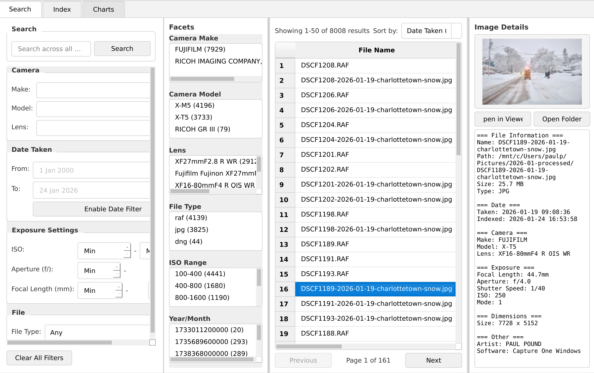

### Index Tab
Manage which directories are indexed. Contains:
- **Directory List**: Folders being indexed
- **Quick Access Buttons**: Fast navigation to common locations
- **Indexing Options**: Recursive scanning toggle
- **Progress Section**: Indexing status and controls
- **Statistics**: Total indexed image count

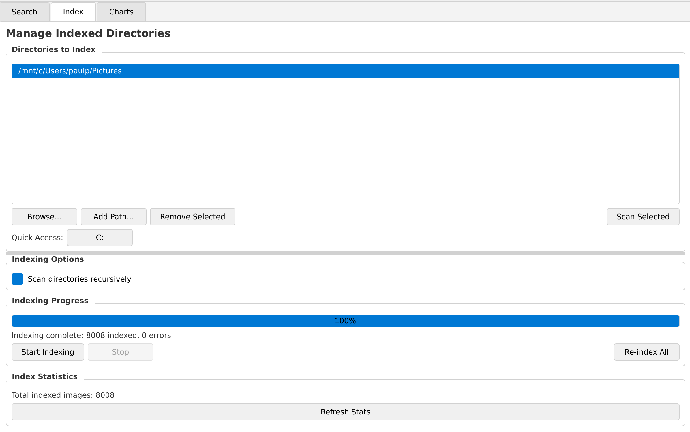

### Charts Tab
Visualize your photo collection statistics:
- Camera and lens usage
- Exposure settings distribution
- Photo timeline
- GPS locations map

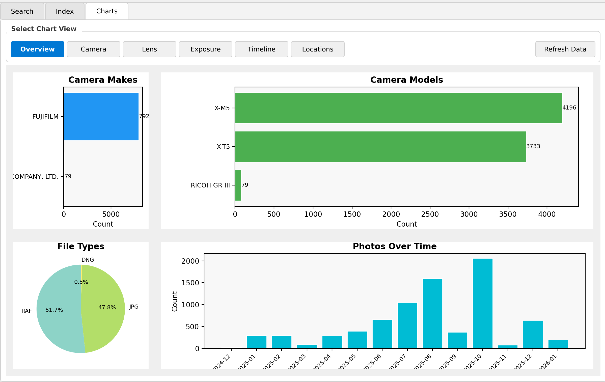

### Resizing Panels

All panels are resizable:
- **Drag the borders** between panels to resize
- Borders highlight **blue** when you hover over them
- The window remembers your panel sizes

---

## Indexing Images

### Adding Directories

#### Method 1: Browse Button
1. Go to the **Index** tab
2. Click **Browse...**
3. Navigate to your image folder
4. Select the folder and click **OK**

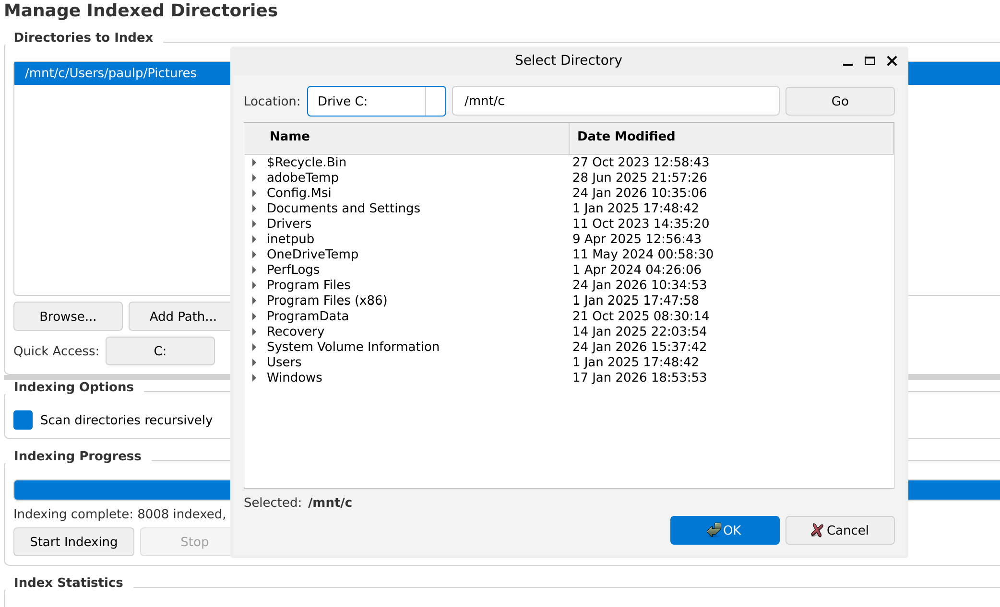

#### Method 2: Add Path Manually
1. Click **Add Path...**
2. Enter the full path:
   - Windows: `C:\Users\Name\Pictures`
   - WSL: `/mnt/c/Users/Name/Pictures`
   - Linux: `/home/user/photos`
3. Click **OK**

#### Method 3: Quick Access Buttons
Click the drive buttons (C:, D:, Pictures) to quickly browse common locations.

### Removing Directories

1. Select a directory in the list
2. Click **Remove Selected**
3. Confirm the removal

> **Note**: Removing a directory from the list does not delete images from the OpenSearch index. Use "Re-index All" to clean up.

### Starting Indexing

1. Ensure directories are added to the list
2. Check **"Scan directories recursively"** to include subfolders
3. Click **Start Indexing**

The progress bar shows:
- Current file being processed
- Total files found
- Percentage complete

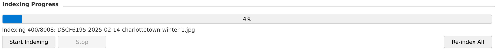

### Indexing Options

- **Recursive scanning**: Include all subfolders (recommended)
- **Scan Selected**: Preview file count before indexing
- **Re-index All**: Delete existing index and start fresh

### What Gets Indexed

PhotoVault extracts and indexes:

| Field | Description | Example |
|-------|-------------|---------|
| File name | Image filename | `IMG_1234.jpg` |
| File path | Full path to image | `/photos/vacation/IMG_1234.jpg` |
| File size | Size in bytes | `4,521,984` |
| File type | Image format | `jpeg`, `raw`, `png` |
| Date taken | When photo was captured | `2024-06-15 14:30:00` |
| Camera make | Camera manufacturer | `Canon`, `Nikon`, `Sony` |
| Camera model | Camera model name | `EOS R5`, `Z6 II` |
| Lens model | Lens used | `RF 24-70mm f/2.8` |
| Focal length | Lens focal length | `50mm` |
| Aperture | f-stop setting | `f/2.8` |
| Shutter speed | Exposure time | `1/250` |
| ISO | Sensitivity setting | `400` |
| GPS coordinates | Location if geotagged | `40.7128, -74.0060` |

---

## Searching Images

### Basic Search

1. Go to the **Search** tab
2. Type keywords in the search box
3. Press **Enter** or click **Search**

The search looks across:
- File names
- Camera make and model
- Lens names
- Artist and copyright fields

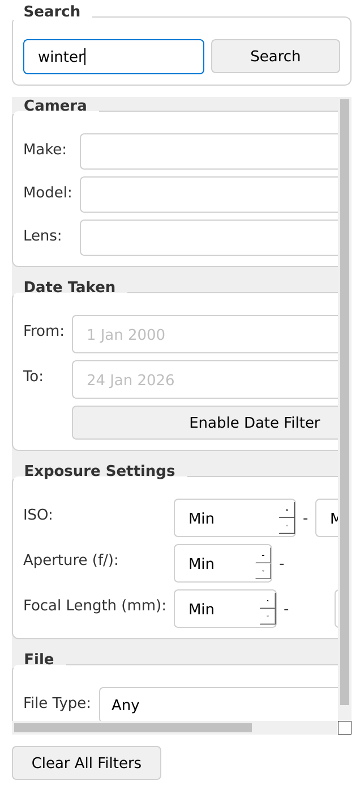

### Field-Specific Filters

Use the filter dropdowns to narrow results:

#### Camera Filters
- **Camera Make**: Filter by manufacturer (Canon, Nikon, Sony, etc.)
- **Camera Model**: Filter by specific camera model

#### Lens Filter
- **Lens Model**: Filter by lens name

#### Date Filter
- **Date Range**: Select start and end dates using the date pickers

#### Exposure Filters
- **ISO Range**: Set minimum and maximum ISO
- **Aperture Range**: Set minimum and maximum f-stop
- **Focal Length Range**: Set minimum and maximum focal length

#### File Type Filter
- **File Type**: Filter by format (JPEG, RAW, PNG, etc.)

### Combining Filters

You can combine multiple filters:
1. Set Camera Make to "Canon"
2. Set ISO Range to 100-800
3. Set Date Range to last year

Click **Search** to apply all filters together.

### Clearing Filters

Click **Clear Filters** to reset all filter fields.

---

## Viewing Results

### Results Table

The results table shows matching images with columns:

| Column | Description |
|--------|-------------|
| File Name | Image filename (click to select) |
| Date Taken | When the photo was captured |
| Camera | Make and model combined |
| Lens | Lens used |
| Focal Length | In millimeters |
| Aperture | f-stop value |
| ISO | Sensitivity setting |
| File Path | Full path to the file |

### Sorting Results

Click the **Sort by** dropdown to change order:
- Date Taken (Newest/Oldest)
- File Name (A-Z/Z-A)
- Camera
- ISO

### Pagination

For large result sets:
- Use **Previous** and **Next** buttons
- Page indicator shows current position
- 50 results per page

### Using Facets

The facets sidebar shows category breakdowns with counts:

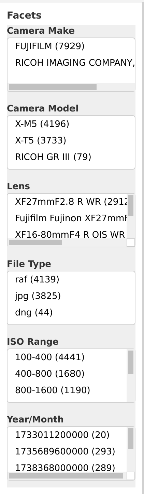

- **Camera Make**: Shows all camera brands with photo counts
- **Camera Model**: Shows all camera models
- **Lens**: Shows all lenses used
- **File Type**: Shows image format distribution
- **ISO Range**: Shows ISO ranges used
- **Year/Month**: Shows photos by time period

**Click any facet item** to filter results to that category.

### Image Details Panel

When you select an image in the results table:

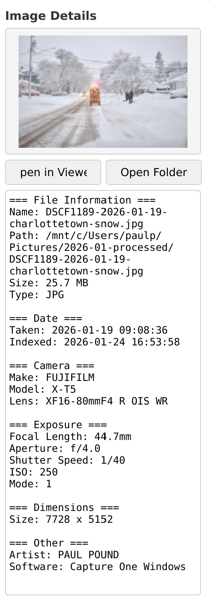

The details panel shows:

1. **Thumbnail Preview**
   - Click the thumbnail to open the image in your default viewer
   - RAW files show embedded preview

2. **Action Buttons**
   - **Open in Viewer**: Opens the full image
   - **Open Folder**: Opens the containing folder

3. **Metadata Sections**
   - File Information (name, path, size, type)
   - Date (taken and indexed)
   - Camera (make, model, lens)
   - Exposure (focal length, aperture, shutter, ISO)
   - Dimensions (width, height, orientation)
   - GPS (latitude, longitude if available)
   - Other (artist, copyright, software)

---

## Using Charts

The Charts tab visualizes your photo collection statistics.

### Chart Views

Click the view buttons to switch between chart types:

| View | Charts Shown |
|------|--------------|
| **Overview** | Camera makes, models, file types, timeline |
| **Camera** | Camera make bar chart, pie chart, model breakdown |
| **Lens** | Lens usage, focal length distribution |
| **Exposure** | ISO ranges, aperture histogram, focal length histogram |
| **Timeline** | Photos over time by month |
| **Locations** | GPS location scatter plot |

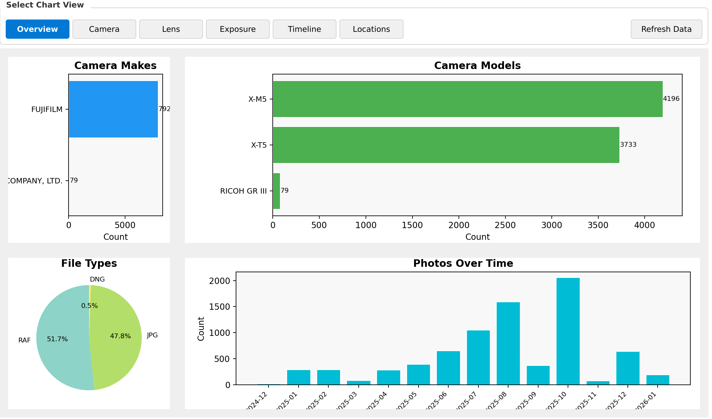

### Camera View

Shows which cameras you use most:
- Bar chart of camera makes
- Pie chart of make distribution
- Detailed model breakdown

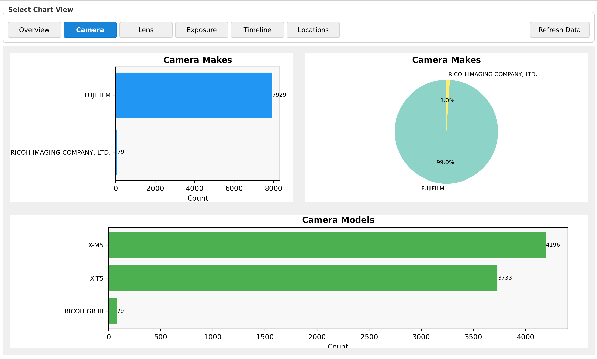

### Lens View

Shows lens usage patterns:
- Most used lenses bar chart
- Focal length distribution histogram

### Exposure View

Shows exposure settings:
- ISO range distribution
- Aperture histogram
- Focal length histogram

### Timeline View

Shows when photos were taken:
- Bar chart by year/month
- Identifies busy photography periods

### Locations View

Shows where photos were taken:
- Scatter plot of GPS coordinates
- Only shows geotagged photos

### Refreshing Charts

Click **Refresh Data** to update charts with current index data.

---

## Settings

Access settings via **File → Settings**.

### OpenSearch Connection

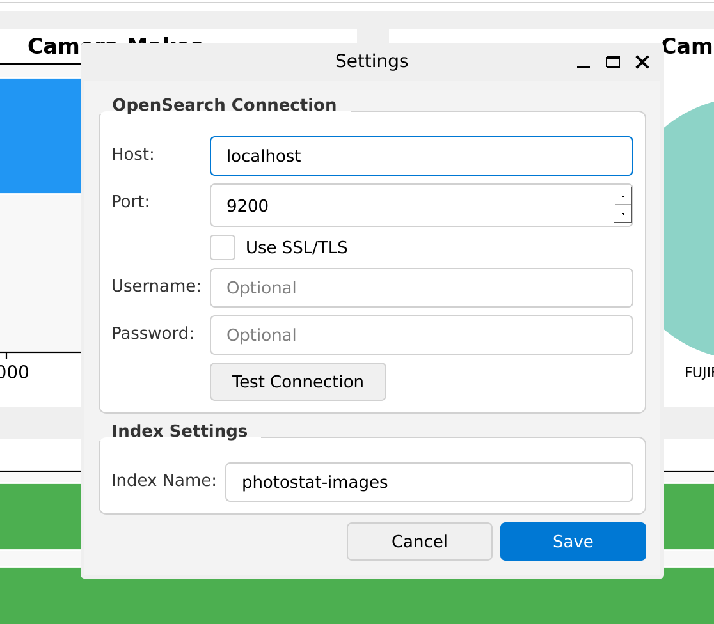

| Setting | Default | Description |
|---------|---------|-------------|
| Host | `localhost` | OpenSearch server hostname |
| Port | `9200` | OpenSearch HTTP port |
| Use SSL | Unchecked | Enable for HTTPS connections |
| Username | (empty) | Authentication username if required |
| Password | (empty) | Authentication password if required |
| Index Name | `photovault-images` | Name of the search index |

### Testing Connection

Click **Test Connection** to verify settings before saving.

### Applying Changes

Click **OK** to save settings and reconnect to OpenSearch.

---

## Tips and Tricks

### Keyboard Shortcuts

| Shortcut | Action |
|----------|--------|
| `Enter` | Execute search |
| `Ctrl+F` | Focus search box |
| `↑/↓` | Navigate results |

### Efficient Workflows

1. **Start with facets**: Use facet clicks to quickly filter, then refine with search
2. **Use date ranges**: Narrow down to specific time periods first
3. **Combine filters**: The more specific, the faster the search

### Managing Large Collections

For collections with 10,000+ images:
- Index incrementally (one directory at a time)
- Use specific filters to reduce result sets
- Consider separate indexes for different collections

### Finding Specific Shots

**By equipment:**
- Filter by camera model to find photos from a specific camera
- Filter by lens to find shots with a particular look

**By settings:**
- Low ISO (100-400) for finding tripod shots
- Wide aperture (f/1.4-f/2.8) for finding portraits
- Long focal length (200mm+) for finding wildlife/sports

**By time:**
- Use date range for event photography
- Use Year/Month facet for seasonal photos

### Backing Up Your Index

The OpenSearch index stores all metadata. To backup:

```bash
# Using OpenSearch snapshot API
curl -X PUT "localhost:9200/_snapshot/backup" -H 'Content-Type: application/json' -d'
{
  "type": "fs",
  "settings": {
    "location": "/path/to/backup"
  }
}'
```

### Re-indexing After Moving Files

If you move image files:
1. Remove old directories from the list
2. Add new directories
3. Click **Re-index All** to refresh

---

## Frequently Asked Questions

### Q: Why are some thumbnails not showing?

**A:** PhotoVault extracts embedded thumbnails for RAW files. If no embedded preview exists, the thumbnail will show a placeholder. The full image can still be opened.

### Q: Can I index network drives?

**A:** Yes, as long as the path is accessible. For Windows network paths in WSL, mount them first:
```bash
sudo mount -t drvfs '\\server\share' /mnt/network
```

### Q: How do I search for photos without GPS data?

**A:** Currently, you can identify photos with GPS by using the Locations chart - photos not shown there lack GPS data.

### Q: Does indexing modify my original images?

**A:** No, PhotoVault only reads EXIF data. Your original images are never modified.

### Q: How much disk space does the index use?

**A:** Approximately 1KB per indexed image. A 100,000 image collection uses about 100MB of index storage.

### Q: Can I use a remote OpenSearch server?

**A:** Yes, configure the host and port in Settings. Enable SSL and provide credentials if required.
